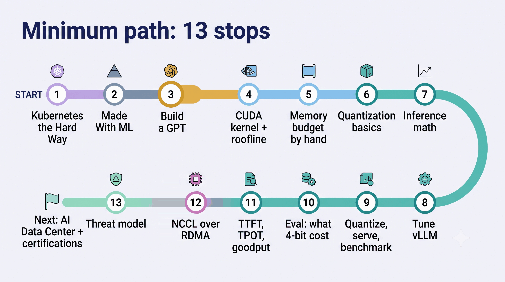
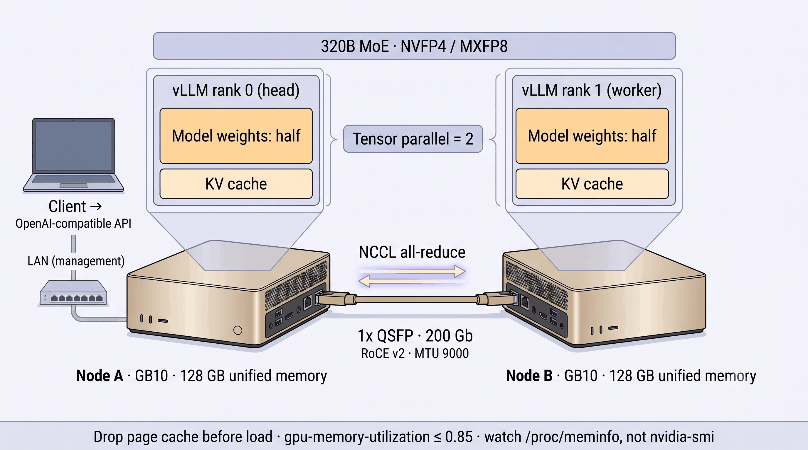

# AI Infrastructure Roadmap 

**English** · [Tiếng Việt](README_vi.md)

> **A note before you start:** I have not finished everything in this roadmap. I am putting it together to set my own goals and learn along the way. If you find mistakes or have better suggestions, please open an issue or a PR — I appreciate any help.

> A learning roadmap for engineers going from DevOps/MLOps into **GPU hardware, AI networking, security, LLMOps and AI Data Centers (AIDC)**.
> Written by a Vietnamese engineer walking this exact path. Resources are grouped by format — **YouTube, Udemy, LinkedIn Learning, NVIDIA DLI, official docs, open-access books** — so you can pick whatever fits how you learn. Every link was checked at the time of writing.

---

## Table of contents

- [AI Infrastructure Roadmap](#ai-infrastructure-roadmap)
  - [Table of contents](#table-of-contents)
  - [📖 How to use this roadmap](#-how-to-use-this-roadmap)
  - [🎯 Minimum path](#-minimum-path)
  - [🗺 Roadmap overview](#-roadmap-overview)
  - [1. Foundations: Linux, Git, Python, networking basics, Docker](#1-foundations-linux-git-python-networking-basics-docker)
    - [Linux \& command line](#linux--command-line)
    - [Git](#git)
    - [Python for infrastructure](#python-for-infrastructure)
    - [Networking basics](#networking-basics)
    - [Docker](#docker)
  - [2. DevOps \& Platform Engineering](#2-devops--platform-engineering)
    - [Kubernetes](#kubernetes)
    - [Infrastructure as Code: Terraform, Ansible](#infrastructure-as-code-terraform-ansible)
    - [CI/CD \& GitOps: Jenkins, GitLab CI, ArgoCD](#cicd--gitops-jenkins-gitlab-ci-argocd)
    - [Observability: Prometheus, Grafana, OpenTelemetry](#observability-prometheus-grafana-opentelemetry)
  - [3. MLOps](#3-mlops)
    - [Principles \& system design](#principles--system-design)
    - [Tools (official docs)](#tools-official-docs)
    - [Structured course (Vietnamese)](#structured-course-vietnamese)
  - [3.5. LLM fundamentals: transformer, tokens, KV cache, MoE](#35-llm-fundamentals-transformer-tokens-kv-cache-moe)
    - [Watch \& build](#watch--build)
    - [Read: the architecture decides memory and speed](#read-the-architecture-decides-memory-and-speed)
  - [4. GPU \& NVIDIA hardware](#4-gpu--nvidia-hardware)
    - [Video](#video)
    - [Books \& docs](#books--docs)
    - [Tools](#tools)
  - [5. AI Networking: interconnect, RDMA, NCCL](#5-ai-networking-interconnect-rdma-nccl)
    - [Video](#video-1)
    - [Books \& docs](#books--docs-1)
  - [6. Security for AI platforms](#6-security-for-ai-platforms)
    - [Video](#video-2)
    - [Books \& docs](#books--docs-2)
  - [7. LLMOps \& large-scale inference](#7-llmops--large-scale-inference)
    - [Video](#video-3)
    - [Books \& docs](#books--docs-3)
    - [Quantization \& low-precision formats](#quantization--low-precision-formats)
    - [Evaluation: what did quantization cost you?](#evaluation-what-did-quantization-cost-you)
    - [Speculative decoding](#speculative-decoding)
    - [LLM serving metrics \& benchmarking](#llm-serving-metrics--benchmarking)
    - [What AI teams build on top: RAG, agents, MCP (know it to run it)](#what-ai-teams-build-on-top-rag-agents-mcp-know-it-to-run-it)
    - [Looking ahead: disaggregated serving (prefill/decode split)](#looking-ahead-disaggregated-serving-prefilldecode-split)
  - [8. AI Data Center (AIDC)](#8-ai-data-center-aidc)
    - [Video](#video-4)
    - [Books \& docs](#books--docs-4)
  - [🎓 Certifications](#-certifications)
  - [🧪 Hands-on projects](#-hands-on-projects)
  - [🧭 Other roadmaps \& curated lists](#-other-roadmaps--curated-lists)
  - [🙏 Acknowledgments](#-acknowledgments)
  - [🤝 Contributing](#-contributing)

---

## 📖 How to use this roadmap

1. Sections 1–3 are the base. Section 3.5 (LLM fundamentals) is the bridge that Sections 4 and 7 assume. Sections 4–8 can be studied in parallel depending on what your job needs. If you already know MLOps, jump straight to Section 3.5.
2. Each section has **Learn** (watch/read) → **Do** (labs) → **Milestone** (something you can show). No milestone, section not done.
3. Legend: 🆓 free · 💰 paid · 🎥 video · 📕 book · 📄 docs/paper · 🧪 lab · ⭐ start here.
4. Keep an English-language engineering journal after each lab. It becomes your portfolio.
5. Short on time? Do the **Minimum path** below first. Everything else is a reference library.

---

## 🎯 Minimum path

The full roadmap is deliberately wide, and it is easy to learn broad and shallow or to give up halfway. If your goal is *run and operate LLM inference on GPU hardware*, do these thirteen in order and treat the rest as look-up material. Each one has a concrete output; do not move on without it.

| # | Resource (section) | Output you should have |
|---|---|---|
| 1 | Kubernetes docs tutorials → Kubernetes The Hard Way (Section 2) | a cluster you built by hand |
| 2 | Made With ML (Section 3) | one model served with monitoring |
| 3 | 3Blue1Brown chapters 5–6 → Karpathy "Let's build GPT" → *AI Infrastructure* (Bojie Li) ch.2 model architecture (Section 3.5) | your own small GPT with a KV cache, and KV bytes per token for GQA vs MLA computed by hand |
| 4 | PMPP lectures (Izzat El Hajj) + GPU MODE Lecture 8 "CUDA Performance Checklist" (Section 4) | a matmul kernel profiled with `ncu` and its roofline |
| 5 | *AI Infrastructure* (Bojie Li) ch.3 workloads, ch.4 accelerator & memory hierarchy, ch.8 inference optimization (Sections 4, 7) | the memory budget of one model (weights + KV cache) computed by hand |
| 6 | MIT 6.5940 Lectures 5–6 "Quantization I & II" + Lecture 13 "LLM Deployment Techniques" (Section 7) | can explain W8A8 vs W4A16 vs NVFP4 and why the group size differs |
| 7 | How to Scale Your Model (Scaling Book), inference chapters (Section 7) | can derive TTFT and TPOT from bandwidth, batch size and model size |
| 8 | vLLM docs: Optimization & Tuning, Conserving memory, Quantization, Metrics (Section 7) | a tuned `vllm serve` exporting Prometheus metrics |
| 9 | DeepLearning.AI × Red Hat "Fast & Efficient LLM Inference with vLLM" (Section 7) | you quantized, served and benchmarked a model yourself |
| 10 | lm-evaluation-harness against your quantized model (Section 7) | a number for what quantization cost you |
| 11 | NVIDIA "LLM Inference Benchmarking" blog series + `vllm bench serve` (Section 7) | a throughput vs p99 TTFT/TPOT chart with goodput against an SLO |
| 12 | NCCL user guide + nccl-tests over your NIC (Section 5) | measured `all_reduce` bus bandwidth and which transport NCCL picked |
| 13 | Container Security (Liz Rice) + OWASP Top 10 for LLM (Section 6) | a one-page threat model for your serving stack |

After these, Section 8 (AI Data Center) and the certifications are the natural next step.

---

## 🗺 Roadmap overview

---

## 1. Foundations: Linux, Git, Python, networking basics, Docker

*Everything later runs on Linux, is managed with Git, automated with Python and talks over TCP/IP.*

### Linux & command line
| Resource | Type | Link |
|---|---|---|
| ⭐ The Linux Command Line (William Shotts) | 🆓📕 | https://linuxcommand.org/tlcl.php |
| MIT — The Missing Semester of Your CS Education | 🆓🎥 | https://missing.csail.mit.edu/ |
| Linux Foundation LFS101 — Introduction to Linux | 🆓🎥 | https://training.linuxfoundation.org/training/introduction-to-linux/ |
| Operating Systems: Three Easy Pieces (OSTEP) | 🆓📕 | https://pages.cs.wisc.edu/~remzi/OSTEP/ |
| Dive into Systems | 🆓📕 | https://diveintosystems.org/ |
| LinkedIn Learning — Strategic Linux for Network Professionals: Security, Monitoring, and Automation | 💰🎥 | https://www.linkedin.com/learning/ (search title) |

### Git
| Resource | Type | Link |
|---|---|---|
| ⭐ Pro Git | 🆓📕 | https://git-scm.com/book/en/v2 |
| Learn Git Branching (interactive) | 🆓🧪 | https://learngitbranching.js.org/ |

### Python for infrastructure
| Resource | Type | Link |
|---|---|---|
| Python official tutorial | 🆓📄 | https://docs.python.org/3/tutorial/ |
| Machine Learning Engineering (Andriy Burkov) | 🆓📕 | http://www.mlebook.com/ |
| The Hundred-Page Machine Learning Book | 🆓📕 | https://themlbook.com/ |

### Networking basics
| Resource | Type | Link |
|---|---|---|
| ⭐ Computer Networks: A Systems Approach (Peterson & Davie) | 🆓📕 | https://book.systemsapproach.org/ |
| Kurose & Ross — free lecture videos for *Computer Networking: A Top-Down Approach* | 🆓🎥 | https://gaia.cs.umass.edu/kurose_ross/index.php |
| Computer Networking: A Top-Down Approach (book) | 💰📕 | https://www.pearson.com/en-us/subject-catalog/p/computer-networking/P200000003334 |
| Practical Networking (YouTube) | 🆓🎥 | https://www.youtube.com/@PracticalNetworking |
| High Performance Browser Networking (Ilya Grigorik) | 🆓📕 | https://hpbn.co/ |
| LinkedIn Learning — Networking Foundations: Networking Basics (Kevin Wallace) | 💰🎥 | https://www.linkedin.com/learning/networking-foundations-networking-basics |

### Docker
| Resource | Type | Link |
|---|---|---|
| ⭐ Docker — Get Started | 🆓📄 | https://docs.docker.com/get-started/ |
| TechWorld with Nana — Docker / Kubernetes / DevOps courses (YouTube) | 🆓🎥 | https://www.youtube.com/@TechWorldwithNana |
| KodeKloud (YouTube) | 🆓🎥 | https://www.youtube.com/@KodeKloud |

🧪 **Do**: build one Ubuntu VM, install Docker, containerize a small Python API behind Nginx, use `tcpdump` and `ss -tulpn` to see where packets go.

---

## 2. DevOps & Platform Engineering

*Kubernetes is the operating system of every AI platform today. This is the toolset you will reuse in every later section.*

### Kubernetes
| Resource | Type | Link |
|---|---|---|
| ⭐ Kubernetes docs & tutorials | 🆓📄 | https://kubernetes.io/docs/tutorials/ |
| Linux Foundation LFS158 — Introduction to Kubernetes | 🆓🎥 | https://training.linuxfoundation.org/training/introduction-to-kubernetes/ |
| Kubernetes The Hard Way (Kelsey Hightower) | 🆓🧪 | https://github.com/kelseyhightower/kubernetes-the-hard-way |
| Killercoda — browser labs | 🆓🧪 | https://killercoda.com/ |
| KodeKloud — courses & labs | 🆓/💰🎥🧪 | https://www.kodekloud.com/ |
| Udemy — Certified Kubernetes Administrator (CKA) with Practice Tests (Mumshad Mannambeth) | 💰🎥 | https://www.udemy.com/course/certified-kubernetes-administrator-with-practice-tests/ |
| LinkedIn Learning — Kubernetes: Provisioning for Infrastructure as Code (Carlos Nunez) | 💰🎥 | https://www.linkedin.com/learning/kubernetes-provisioning-for-infrastructure-as-code |
| LinkedIn Learning — Getting Started with Kubernetes (learning path) | 💰🎥 | https://www.linkedin.com/learning/paths/getting-started-with-kubernetes |
| roadmap.sh — Kubernetes | 🆓📄 | https://roadmap.sh/kubernetes |

### Infrastructure as Code: Terraform, Ansible
| Resource | Type | Link |
|---|---|---|
| Terraform tutorials | 🆓📄🧪 | https://developer.hashicorp.com/terraform/tutorials |
| Ansible docs | 🆓📄 | https://docs.ansible.com/ |

### CI/CD & GitOps: Jenkins, GitLab CI, ArgoCD
| Resource | Type | Link |
|---|---|---|
| Jenkins docs | 🆓📄 | https://www.jenkins.io/doc/ |
| ⭐ ArgoCD docs | 🆓📄 | https://argo-cd.readthedocs.io/ |
| CNCF (YouTube) — KubeCon talks | 🆓🎥 | https://www.youtube.com/@cncf |

### Observability: Prometheus, Grafana, OpenTelemetry
| Resource | Type | Link |
|---|---|---|
| Prometheus docs | 🆓📄 | https://prometheus.io/docs/introduction/overview/ |
| Grafana docs | 🆓📄 | https://grafana.com/docs/ |
| OpenTelemetry docs | 🆓📄 | https://opentelemetry.io/docs/ |
| ⭐ Google SRE books | 🆓📕 | https://sre.google/books/ |

🧪 **Do**: k3s/kubeadm cluster with 2–3 nodes → Helm → ArgoCD syncing from Git → kube-prometheus-stack → dashboards and alerts for one service.
**Milestone**: a Git repository where every `git push` is automatically deployed to your cluster by ArgoCD, and a Grafana dashboard with at least one working alert for a running service.

---

## 3. MLOps

*From notebook to an ML system that runs automatically, with versioning, monitoring and a retrain loop. This is the direct base for LLMOps.*

### Principles & system design
| Resource | Type | Link |
|---|---|---|
| ⭐ Made With ML (Goku Mohandas) | 🆓📕🧪 | https://madewithml.com/ |
| ⭐ Machine Learning Systems (Vijay Janapa Reddi) | 🆓📕 | https://mlsysbook.ai/ |
| ml-ops.org — principles & maturity model | 🆓📄 | https://ml-ops.org/ |
| Google — Practitioners Guide to MLOps | 🆓📄 | https://cloud.google.com/resources/mlops-whitepaper |
| Full Stack Deep Learning | 🆓🎥 | https://fullstackdeeplearning.com/ |
| DataTalks.Club — MLOps Zoomcamp (course + YouTube) | 🆓🎥🧪 | https://github.com/DataTalksClub/mlops-zoomcamp · https://www.youtube.com/@DataTalksClub |
| LinkedIn Learning — MLOps Essentials for Developers and AI Engineers: Tools, Pipelines, Security (learning path) | 💰🎥 | https://www.linkedin.com/learning/paths/mlops-essentials-for-developers-and-ai-engineers-tools-pipelines-security |
| Udemy — The Complete Guide to AI Infrastructure: Zero to Hero | 💰🎥🧪 | https://www.udemy.com/course/complete-guide-ai-infrastructure/ |
| roadmap.sh — MLOps | 🆓📄 | https://roadmap.sh/mlops |

### Tools (official docs)
| Tool | Role | Link |
|---|---|---|
| MLflow | experiment tracking, model registry | https://mlflow.org/docs/latest/index.html |
| DVC | data/model versioning | https://dvc.org/doc |
| Apache Airflow | orchestration | https://airflow.apache.org/docs/ |
| Kubeflow | ML platform on Kubernetes | https://www.kubeflow.org/docs/ |
| Feast | feature store | https://feast.dev/ |
| Ray | distributed training/serving | https://docs.ray.io/ |
| KServe | model serving on Kubernetes | https://kserve.github.io/website/ |
| Triton Inference Server | multi-framework GPU serving | https://github.com/triton-inference-server/server |
| Evidently | drift & data-quality monitoring | https://www.evidentlyai.com/ |

### Structured course (Vietnamese)
| Resource | Type | Link |
|---|---|---|
| ⭐ Full Stack Data Science — cohort-based MLOps/LLMOps course with rubric-graded projects | 💰🎥🧪 | https://fullstackdatascience.com/ |

🧪 **Do**: train → MLflow registry → KServe/Triton → Evidently drift → alert → automatic retrain → canary.
**Milestone**: one repository that trains a model, registers it in MLflow, serves it on Kubernetes, detects data drift with Evidently, and automatically retrains and redeploys (canary) when drift is detected — all triggered without manual steps.

---

## 3.5. LLM fundamentals: transformer, tokens, KV cache, MoE

*The bridge between MLOps and everything after it. You cannot size a KV cache, choose a parallelism, read a quantization config or explain why decode is memory-bound until you know what a transformer computes for each token and what it has to keep in memory. Sections 4 and 7 assume this section.*

**Goal**: given any model's `config.json`, work out by hand its total and active parameters, FLOPs per token, weight memory at BF16 / FP8 / NVFP4 and KV-cache bytes per token, and explain what changes between prefill and decode.

### Watch & build
| Resource | Type | Link |
|---|---|---|
| ⭐ 3Blue1Brown — Chapter 5 "But what is a GPT?" and Chapter 6 "Attention in transformers, step by step" (intuition first) | 🆓🎥 | https://www.3blue1brown.com/lessons/gpt/ · https://www.3blue1brown.com/lessons/attention/ |
| Andrej Karpathy — Deep Dive into LLMs like ChatGPT (3.5 h, the whole stack: pretraining data, tokenization, the network, SFT, RL) | 🆓🎥 | https://www.youtube.com/watch?v=7xTGNNLPyMI |
| ⭐ Andrej Karpathy — Neural Networks: Zero to Hero, Lecture 7 "Let's build GPT: from scratch, in code, spelled out" and Lecture 8 "Let's build the GPT Tokenizer" (start from Lecture 1 if backpropagation is new to you) | 🆓🎥🧪 | https://www.youtube.com/watch?v=kCc8FmEb1nY · https://www.youtube.com/watch?v=zduSFxRajkE · https://github.com/karpathy/nn-zero-to-hero |
| Interactive: Transformer Explainer (a live GPT-2 in your browser) · LLM Visualization (Brendan Bycroft, a 3D walkthrough of one token of inference) | 🆓🧪 | https://poloclub.github.io/transformer-explainer/ · https://bbycroft.net/llm |
| ⭐ Stanford CS336 — Lecture 1 "Overview and Tokenization", Lecture 2 "PyTorch, Resource Accounting", Lecture 3 "Architectures, Hyperparameters", Lecture 4 "Mixture of Experts", plus Assignment 1 "Basics" (BPE tokenizer, transformer and AdamW from scratch). This is the deep option, and the same course continues into Sections 4 and 7 | 🆓🎥🧪 | https://cs336.stanford.edu/ · https://www.youtube.com/watch?v=SQ3fZ1sAqXI · https://github.com/stanford-cs336/assignment1-basics |
| Build a Large Language Model (From Scratch) (Sebastian Raschka) — the book is paid, the code is free. Bonus notebooks implement KV cache (`ch04/03_kv-cache`), GQA (`ch04/04_gqa`), MLA (`ch04/05_mla`), sliding-window attention, MoE (`ch04/07_moe`), a FLOPs analysis, and Llama 3 / Qwen3 / Gemma from scratch | 💰📕 · 🆓🧪 | https://github.com/rasbt/LLMs-from-scratch |
| AI Engineering from Scratch (Rohit Ghumare) — Phase 7 "Transformers Deep Dive" and Phase 10 "LLMs from Scratch": build attention, a tokenizer, a mini-GPT, KV cache, quantization, speculative decoding and multi-token prediction by hand in plain Python and NumPy, with a quiz per lesson. Toy scale, so pair it with Karpathy or CS336 for PyTorch | 🆓📄🧪 | https://github.com/rohitg00/ai-engineering-from-scratch/tree/main/phases/07-transformers-deep-dive · https://github.com/rohitg00/ai-engineering-from-scratch/tree/main/phases/10-llms-from-scratch |

### Read: the architecture decides memory and speed
| Resource | Type | Link |
|---|---|---|
| ⭐ AI Infrastructure (Bojie Li) — ch.1 (§1.3 estimating one model execution with a few numbers) and ch.2 model architecture (§2.2 prefill, decode and state reuse; §2.3 multi-head attention and KV sharing, MLA, sliding windows, linear and hybrid attention, "how much to store per token, how much to read per decode"; §2.4 expert routing and per-batch weight reads) | 🆓📕 | https://bojieli.github.io/ai-infra-book/en/ |
| ⭐ EleutherAI — Transformer Math 101 (training FLOPs ≈ 6 × parameters × tokens; memory for weights, optimizer states and activations) · kipply — Transformer Inference Arithmetic (KV-cache size, when decode is memory-bound, a simple latency model) | 🆓📄 | https://blog.eleuther.ai/transformer-math/ · https://kipp.ly/transformer-inference-arithmetic/ |
| Sebastian Raschka — The Big LLM Architecture Comparison (GPT-2 to DeepSeek-V3, Llama 4, Qwen3, GLM: RoPE, GQA, MLA, MoE, normalization placement) and the LLM Architecture Gallery | 🆓📄 | https://magazine.sebastianraschka.com/p/the-big-llm-architecture-comparison · https://sebastianraschka.com/llm-architecture-gallery/ |
| Jay Alammar — The Illustrated Transformer · Harvard NLP — The Annotated Transformer (the original paper as about 400 lines of runnable code) | 🆓📄🧪 | https://jalammar.github.io/illustrated-transformer/ · https://nlp.seas.harvard.edu/annotated-transformer/ |
| Dive into Deep Learning — Chapter 11 "Attention Mechanisms and Transformers" (textbook reference with code) | 🆓📕 | https://d2l.ai/chapter_attention-mechanisms-and-transformers/ |
| Outcome School (Amit Shekhar) — AI Engineering Course, Module 3 "Generative AI and the Transformer Architecture" and Module 5 "Modern LLM Architecture", plus the companion `llm-internals` index: plain-language blog lessons on BPE, the math behind Q/K/V and the √dₖ scaling, causal masking, RoPE, MoE, GQA, sliding-window attention, attention sinks, FlashAttention and DeepSeek-V4. A gentle first pass or a quick review; no code or labs | 🆓📄🎥 | https://github.com/amitshekhariitbhu/ai-engineering-course · https://github.com/amitshekhariitbhu/llm-internals |
| Papers to know by name: Attention Is All You Need · multi-query attention (Shazeer) · GQA · RoPE (RoFormer) · DeepSeek-V2 (MLA: 93 % less KV cache than DeepSeek 67B) · Mixtral of Experts (47B total, 13B active parameters) · scaling laws (Kaplan) and Chinchilla (compute-optimal training) | 🆓📄 | https://arxiv.org/abs/1706.03762 · https://arxiv.org/abs/1911.02150 · https://arxiv.org/abs/2305.13245 · https://arxiv.org/abs/2104.09864 · https://arxiv.org/abs/2405.04434 · https://arxiv.org/abs/2401.04088 · https://arxiv.org/abs/2001.08361 · https://arxiv.org/abs/2203.15556 |
| Post-training in one book: RLHF Book (Nathan Lambert, free online) — SFT, reward models, DPO, RL; what "rollout" and "policy update" mean when they show up as infrastructure workloads | 🆓📕 | https://rlhfbook.com/ |

🧪 **Do**
1. Watch 3Blue1Brown chapters 5–6, then code along with Karpathy's "Let's build GPT" and train the character-level model on a small text.
2. Add a KV cache to your generation loop. Measure tokens/s with and without it for 256 and 2,048 generated tokens. Raschka's `ch04/03_kv-cache` is the reference.
3. Replace multi-head attention with GQA (Raschka `ch04/04_gqa`) and compute KV bytes per token before and after.
4. Tokenizer check: count tokens for the same paragraph in English and in Vietnamese with the tokenizer of the model you serve (`AutoTokenizer.from_pretrained(...)`). That ratio is a real cost multiplier: more tokens mean more KV cache, longer TTFT and higher cost for the same text.
5. Paper exercise: open the `config.json` of one dense model (for example Llama-3.1-8B) and one MoE model with MLA (for example DeepSeek-V3, or the model you actually serve). Compute total and active parameters, FLOPs per generated token (about 2 × active parameters), weight memory at BF16 / FP8 / NVFP4, and KV-cache bytes per token for MHA vs GQA vs MLA. Check your numbers against https://elinx.github.io/llm-mem-calculator/ and against what vLLM logs at startup.
6. Prefill vs decode: time one forward pass over a 2,048-token prompt against 256 single-token decode steps on your GPU, and explain the difference in tokens/s with arithmetic intensity. This is the bridge into Section 4.

**Milestone**: a repo or notebook with (1) your small GPT with a working KV-cache generation loop and the measured speedup, and (2) a one-page "infra model card" for the model you actually serve: total and active parameters, layers, attention type (MHA / GQA / MLA) and KV heads, KV bytes per token at BF16 and FP8, weight size at BF16 / FP8 / NVFP4, and FLOPs per token, each number computed by hand and checked against a measurement. After this, Karpathy's "Let's reproduce GPT-2" in Section 7 shows the same model at the systems level.

---

## 4. GPU & NVIDIA hardware

*The part most MLOps roadmaps skip. Learn NVIDIA first; other vendors follow the same model (SIMT, memory hierarchy, interconnect).*

**Goal**: for any workload, answer *what moves, how much, how many times, through where, and who waits* — and explain why LLM inference is memory-bound.

### Video
| Resource | Type | Link |
|---|---|---|
| ⭐ PMPP official channel — Izzat El Hajj's GPU Computing lectures | 🆓🎥 | https://www.youtube.com/@pmpp-book |
| ⭐ GPU MODE (YouTube + lecture repo) | 🆓🎥 | https://www.youtube.com/@GPUMODE · https://github.com/gpu-mode/lectures |
| freeCodeCamp — NCA-AIIO prep course (4 h) | 🆓🎥 | https://www.freecodecamp.org/news/pass-the-nvidia-certified-associate-ai-infrastructure-and-operations-certification-exam/ |
| NVIDIA Developer (YouTube) & GTC on-demand | 🆓🎥 | https://www.youtube.com/@NVIDIADeveloper · https://www.nvidia.com/gtc/ |
| OLCF CUDA Training Series (Oak Ridge) | 🆓🎥🧪 | https://www.olcf.ornl.gov/cuda-training-series/ |
| MIT 6.5940 — TinyML & Efficient AI Computing (Song Han): Fall 2024 recordings; new run Fall 2026. The quantization lectures are listed in Section 7 | 🆓🎥🧪 | https://efficientml.ai · https://hanlab.mit.edu/courses/2024-fall-65940 · https://hanlab.mit.edu/courses/2026-fall-65940 |
| CMU — Deep Learning Systems | 🆓🎥 | https://dlsyscourse.org/ |
| Stanford CS336 — Language Modeling from Scratch: Lecture 5 GPUs, 6 kernels/Triton, 7–8 parallelism, 10 inference; Assignment 2 "Systems" (Triton kernels, FlashAttention, DDP, optimizer sharding) | 🆓🎥🧪 | https://cs336.stanford.edu/ · https://github.com/stanford-cs336 |
| CMU 15-442/642 — Machine Learning Systems (Tianqi Chen): public assignments on Blackwell GEMM optimization and distributed training | 🆓📄🧪 | https://mlsyscourse.org/ · https://github.com/mlsyscourse |
| NVIDIA DLI — Fundamentals of Accelerated Computing with CUDA C/C++ | 💰🎥🧪 | https://learn.nvidia.com/ |
| Udemy — CUDA GPU Programming Beginner To Advanced | 💰🎥 | https://www.udemy.com/course/cuda-gpu-programming-beginner-to-advanced/ |
| Udemy — Mastering Parallel programming with CUDA platform | 💰🎥 | https://www.udemy.com/course/mastering-parallel-programming-with-cuda-platform/ |
| Udemy — NVIDIA-Certified Professional: AI Infrastructure (NCP-AII) | 💰🎥 | https://www.udemy.com/course/ncp-aii-nvidia-certified-professional-ai-infrastructure/ |

### Books & docs
| Resource | Type | Link |
|---|---|---|
| ⭐ AI Infrastructure (Bojie Li) — open-source book, English edition: ch.3 workloads (§3.1.1 prefill and decode), ch.4 accelerator architecture (§4.2.4 low precision, §4.3 memory hierarchy, §4.3.1 GPU memory and unified memory), ch.5 operators & runtime (§5.3.3 FlashAttention: tiling and online softmax) | 🆓📕 | https://bojieli.github.io/ai-infra-book/en/ · https://github.com/bojieli/ai-infra-book/tree/main/book-en |
| Programming Massively Parallel Processors, 4th ed. (Hwu, Kirk, El Hajj) | 💰📕 | https://shop.elsevier.com/books/programming-massively-parallel-processors/hwu/978-0-323-91231-0 |
| CUDA C++ Programming Guide | 🆓📄 | https://docs.nvidia.com/cuda/cuda-c-programming-guide/index.html |
| An Even Easier Introduction to CUDA (NVIDIA blog) | 🆓📄 | https://developer.nvidia.com/blog/even-easier-introduction-cuda/ |
| GPU Gems 1–3 | 🆓📕 | https://developer.nvidia.com/gpugems/gpugems/contributors |
| NVIDIA Blackwell architecture | 🆓📄 | https://resources.nvidia.com/en-us-blackwell-architecture |
| Horace He — Making Deep Learning Go Brrrr From First Principles (compute-bound vs memory-bound vs overhead-bound) | 🆓📄 | https://horace.io/brrr_intro.html |
| Modal — GPU Glossary ("GPU documentation for humans": SM, warp, HBM, tensor cores, CUDA graphs) | 🆓📄 | https://modal.com/gpu-glossary |

### Tools
| Tool | Link |
|---|---|
| Nsight Systems / Nsight Compute | https://developer.nvidia.com/nsight-systems |
| DCGM + dcgm-exporter | https://docs.nvidia.com/datacenter/dcgm/latest/index.html |
| NVIDIA GPU Operator (driver, device plugin, MIG / time-slicing / MPS) | https://docs.nvidia.com/datacenter/cloud-native/gpu-operator/latest/index.html |
| Kueue (job queueing, GPU quotas) | https://kueue.sigs.k8s.io/ |
| DGX Spark docs & playbooks (playbook sources on GitHub) | https://docs.nvidia.com/dgx/dgx-spark/ · https://build.nvidia.com/spark · https://github.com/NVIDIA/dgx-spark-playbooks |

🧪 **Do**
1. `nvidia-smi -q`, `nvidia-smi topo -m`, `lspci -tv` → draw the CPU–GPU–memory–NIC diagram of your machine.
2. DCGM exporter → Grafana: SM active, DRAM active, tensor-core active.
3. Write a matmul kernel, profile with `nsys`/`ncu`, compute arithmetic intensity, draw the roofline.
4. Run vLLM with an 8B model, measure tokens/s at batch 1 → 32, explain it with the roofline.
5. Compute by hand: 70B FP8 weights + KV cache at 32k context — does it fit your GPU? Cross-check with a calculator: https://elinx.github.io/llm-mem-calculator/ (handles GQA, MLA, MoE) or https://github.com/engineering87/sparkfit (DGX Spark specific).

> ⚠️ **Unified memory is a different game (GB10 / DGX Spark, Grace Hopper, Grace Blackwell).** On a discrete GPU an over-allocation fails with a CUDA OOM and only your process dies. On GB10 the CPU and GPU share one 128 GB LPDDR5x pool with *no fixed carve-out* (DGX Spark Porting Guide), so allocations keep succeeding until the driver itself runs out — and then the whole machine can hang: no OOM-kill, no kernel panic, SSH gone, hard power cycle. The Linux OOM killer and cgroup limits cannot see pinned CUDA memory, so they do not save you. I learned this in practice; few documents say it. Rules that NVIDIA docs and the community converge on:
> - `nvidia-smi` prints `Memory-Usage: Not Supported` on GB10; watch `/proc/meminfo` or `free -h` instead. `cudaMemGetInfo` under-reports free memory (NVIDIA Known Issues, KB 5728).
> - Page cache counts against CUDA-visible memory (a community measurement: writing a 60 GB file dropped CUDA-free from ~103 to ~42 GiB while `MemAvailable` stayed at ~115 GiB). Run `sync; echo 3 > /proc/sys/vm/drop_caches` before every model load; every official Spark playbook does.
> - Budget roughly 100 GiB usable per node, not 128; keep vLLM `--gpu-memory-utilization` at 0.85 or below; set `vm.swappiness=0` (or `swapoff -a`); run `earlyoom -m 10 -s 100,100` so SSH survives an over-allocation.
> - Read: DGX Spark Porting Guide https://docs.nvidia.com/dgx/dgx-spark-porting-guide/index.html · Known Issues https://docs.nvidia.com/dgx/dgx-spark/known-issues.html · KB 5775 https://nvidia.custhelp.com/app/answers/detail/a_id/5775 · CUDA Programming Guide, Unified Memory https://docs.nvidia.com/cuda/cuda-programming-guide/04-special-topics/unified-memory.html · the open driver issue https://github.com/NVIDIA/open-gpu-kernel-modules/issues/1358 · vLLM issue https://github.com/vllm-project/vllm/issues/56824 · a hardened setup guide https://github.com/natolambert/dgx-spark-setup · Bojie Li ch.4 §4.3.1 GPU memory and unified memory.

**Milestone**: a short blog post or repo doc with (1) a diagram of your machine's CPU–GPU–memory–NIC topology, (2) a roofline chart of your GPU built from your own Nsight measurements, and (3) measured vLLM tokens/s at several batch sizes with an explanation of where the bottleneck is. If you want a certificate at this stage, take **NCA-AIIO**.

---

## 5. AI Networking: interconnect, RDMA, NCCL

*Fast GPUs are useless if data does not arrive in time. From inside the box (NVLink/PCIe) to between boxes (RDMA / InfiniBand / RoCE) to Kubernetes.*

### Video
| Resource | Type | Link |
|---|---|---|
| ⭐ NVIDIA Networking Academy — InfiniBand, RoCE, Spectrum-X, Cumulus Linux | 🆓🎥 | https://academy.nvidia.com/ |
| GPU MODE — Lecture 17: GPU Collective Communication (NCCL, Dan Johnson); Lecture 67: NCCL & NVSHMEM (Jeff Hammond) | 🆓🎥 | https://github.com/gpu-mode/lectures |
| CNCF (YouTube) — search "Kubernetes networking" KubeCon talks | 🆓🎥 | https://www.youtube.com/@cncf |
| Udemy — InfiniBand Fundamentals for AI & HPC Data Centers | 💰🎥🧪 | https://www.udemy.com/course/infiniband-fundamentals/ |
| Udemy — NCP-AIN practice tests | 💰🎥 | https://www.udemy.com/course/nvidia-ai-networking-ncp-ain/ · https://www.udemy.com/course/ai-networking-certification-prep-questions-ncp-ain/ |
| LinkedIn Learning — Kubernetes: Cloud Native Ecosystem (Karthik Gaekwad) | 💰🎥 | https://www.linkedin.com/learning/ (search title) |

### Books & docs
| Resource | Type | Link |
|---|---|---|
| ⭐ AI Infrastructure (Bojie Li) — ch.6 supernodes (§6.2 six parallelism strategies, §6.4 collective communication cost), ch.7 data-center networks (§7.2 cross-node traffic, multi-NIC and multi-rail, §7.3 RDMA paths) | 🆓📕 | https://bojieli.github.io/ai-infra-book/en/ |
| NCCL user guide + environment variables (`NCCL_IB_HCA`, `NCCL_SOCKET_IFNAME`, `NCCL_IB_GID_INDEX`, `NCCL_NET_GDR_LEVEL`) + nccl-tests | 🆓📄🧪 | https://docs.nvidia.com/deeplearning/nccl/user-guide/docs/index.html · https://docs.nvidia.com/deeplearning/nccl/user-guide/docs/env.html · https://github.com/NVIDIA/nccl-tests |
| vLLM docs — Parallelism and Scaling (multi-node TP/PP, Ray vs multiprocessing, `NCCL_DEBUG=TRACE` to confirm RDMA vs TCP) | 🆓📄 | https://docs.vllm.ai/en/stable/serving/parallelism_scaling/ |
| DGX Spark playbooks — Connect two Sparks, NCCL on two Sparks, performance benchmarking guide (`ib_write_bw`, `vllm bench`) | 🆓📄🧪 | https://github.com/NVIDIA/dgx-spark-playbooks/blob/main/nvidia/connect-two-sparks/README.md · https://github.com/NVIDIA/dgx-spark-playbooks/blob/main/nvidia/nccl/README.md · https://github.com/NVIDIA/dgx-spark-playbooks/blob/main/nvidia/connect-two-sparks/assets/performance_benchmarking_guide.md |
| Learning eBPF (Liz Rice) — free from Isovalent | 🆓📕 | https://isovalent.com/books/learning-ebpf/ |
| ebpf.io | 🆓📄 | https://ebpf.io/ |
| Cilium docs | 🆓📄 | https://docs.cilium.io/ |
| Istio docs | 🆓📄 | https://istio.io/latest/docs/ |

🧪 **Do** (needs two machines with high-speed NICs — I use two DGX Spark linked over one QSFP cable; writeup in Hands-on projects)
1. `iperf3` (TCP) vs `ib_write_bw` (RDMA, perftest).
2. Enable RoCE v2 + PFC/ECN; run `all_reduce_perf` with `NCCL_DEBUG=INFO`; read which transport NCCL picked. Sanity numbers on two DGX Spark: `ib_write_bw` around 185–190 Gb/s, NCCL `all_reduce` bus bandwidth around 18–24 GB/s with MTU 9000. If you see about 3 GB/s, NCCL fell back to TCP: wrong interface, MTU 1500, or a NCCL build older than 2.28 that predates GB10.
3. vLLM tensor-parallel across 2 nodes; compare RDMA vs forced Socket transport.
4. Kubernetes + Cilium; trace one packet ingress → pod with Hubble; write a default-deny NetworkPolicy and open it step by step.

**Milestone**: a document describing your lab network end to end — the physical links, IP/VLAN layout, RDMA configuration, NCCL benchmark results (bandwidth and latency for `all_reduce`), and the Kubernetes CNI/NetworkPolicy setup — with the actual numbers from `iperf3`, `ib_write_bw` and `nccl-tests`. If you want a certificate at this stage, take **NCP-AIN**.

---

## 6. Security for AI platforms

*Threat model → zero trust → supply chain → LLM security.*

### Video
| Resource | Type | Link |
|---|---|---|
| ⭐ Kim Wüstkamp — Kubernetes CKS Full Course (free on YouTube) | 🆓🎥🧪 | https://www.youtube.com/watch?v=d9xfB5qaOfg |
| Udemy — Kubernetes CKS Complete Course (Kim Wüstkamp, includes killer.sh simulator sessions) | 💰🎥🧪 | https://killer.sh/r?d=cks-course |
| LinkedIn Learning — Securing Containers and Kubernetes Ecosystem (Sam Sehgal) | 💰🎥 | https://www.linkedin.com/learning/securing-containers-and-kubernetes-ecosystem |
| LinkedIn Learning — Cert Prep: Kubernetes and Cloud Native Security Associate (KCSA) (Michael Levan) | 💰🎥 | https://www.linkedin.com/learning/cert-prep-kubernetes-and-cloud-native-security-associate-kcsa |
| LinkedIn Learning — Understanding Zero Trust (Malcolm Shore) | 💰🎥 | https://www.linkedin.com/learning/ (search title) |
| KodeKloud — CKS course & challenges | 💰🎥🧪 | https://www.kodekloud.com/ |
| Killercoda — CKS scenarios | 🆓🧪 | https://killercoda.com/ |

### Books & docs
| Resource | Type | Link |
|---|---|---|
| ⭐ Container Security, 2nd ed. (Liz Rice) — free from Isovalent | 🆓📕 | https://isovalent.com/books/container-security/ |
| Kubernetes security concepts | 🆓📄 | https://kubernetes.io/docs/concepts/security/ |
| NSA/CISA Kubernetes Hardening Guide | 🆓📄 | https://www.cisa.gov/news-events/alerts/2022/03/15/updated-kubernetes-hardening-guide |
| NIST SP 800-190 — Application Container Security Guide | 🆓📄 | https://csrc.nist.gov/pubs/sp/800/190/final |
| NIST AI Risk Management Framework | 🆓📄 | https://www.nist.gov/itl/ai-risk-management-framework |
| CKS curated resources (walidshaari) | 🆓📄 | https://github.com/walidshaari/Certified-Kubernetes-Security-Specialist |
| Kyverno docs | 🆓📄 | https://kyverno.io/docs/ |
| HashiCorp Vault tutorials | 🆓📄🧪 | https://developer.hashicorp.com/vault/tutorials |
| Sigstore / cosign docs | 🆓📄 | https://docs.sigstore.dev/ |
| ⭐ OWASP Top 10 for LLM Applications | 🆓📄 | https://genai.owasp.org/ |
| MITRE ATLAS | 🆓📄 | https://atlas.mitre.org/ |
| NVIDIA garak — LLM vulnerability scanner | 🆓🧪 | https://github.com/NVIDIA/garak |
| NVIDIA NeMo Guardrails | 🆓🧪 | https://github.com/NVIDIA/NeMo-Guardrails |
| roadmap.sh — Cyber Security | 🆓📄 | https://roadmap.sh/cyber-security |

🧪 **Do**
1. One-page threat model (STRIDE) for your ML system.
2. Kyverno: enforce `runAsNonRoot`, block `privileged`, require labels; test with a violating pod.
3. Vault + External Secrets Operator; remove every secret from the repo; drop `cluster-admin` from CI.
4. CI: Trivy scan → cosign sign → Kyverno `verifyImages`.
5. mTLS STRICT (Istio or Cilium); verify with tcpdump.
6. Falco runtime alerts; garak scan of an LLM endpoint.

**Milestone**: a pull request merged into your project that adds Kyverno policies, Vault-managed secrets, signed images verified at admission, mTLS between services, and a Falco alert rule — plus a one-page threat-model document explaining what each control protects against. If you want a certificate at this stage, take **KCSA** first, then **CKS**.

---

## 7. LLMOps & large-scale inference

*Operating LLMs = MLOps + GPU memory as the scarcest resource + quantization as the lever that makes a model fit + new evaluation (eval harnesses, LLM-as-judge) + latency that is not one number (TTFT, TPOT) + cost per token + the application stack teams build on top (RAG, agents, MCP) that ops has to deploy and test.*

### Video
| Resource | Type | Link |
|---|---|---|
| ⭐ GPU Optimization Workshop (MLOps.community) — talks from TensorRT-LLM (NVIDIA) and Triton (OpenAI) engineers | 🆓🎥 | https://github.com/mlops-discord/gpu-optimization-workshop |
| GPU MODE — Lecture 22 (speculative decoding in vLLM), Lecture 35 (SGLang performance), Lecture 40 (FlashInfer) | 🆓🎥 | https://github.com/gpu-mode/lectures |
| Stanford CS336 — Lecture 10 "Inference", Lecture 12 "Evaluation" (Spring 2025 recordings and code) | 🆓🎥 | https://cs336.stanford.edu/ · https://github.com/stanford-cs336/spring2025-lectures |
| Andrej Karpathy — Let's reproduce GPT-2 (124M): what a training loop does at the systems level (DDP, mixed precision, `torch.compile`) | 🆓🎥🧪 | https://youtu.be/l8pRSuU81PU · https://github.com/karpathy/build-nanogpt |
| DeepLearning.AI — Efficiently Serving LLMs (Travis Addair, Predibase): batching, continuous batching, quantization, multi-LoRA | 🆓🎥🧪 | https://www.deeplearning.ai/courses/efficiently-serving-llms |
| NVIDIA DLI — Sizing LLM Inference Systems (free, self-paced) | 🆓🎥🧪 | https://learn.nvidia.com/courses/course-detail?course_id=course-v1:DLI+S-FX-18+V1 |
| NVIDIA DLI — Model Parallelism: Building and Deploying Large Neural Networks | 💰🎥🧪 | https://learn.nvidia.com/courses/course-detail?course_id=course-v1:DLI+C-FX-07+V1 |
| NVIDIA Developer (YouTube) — Dynamo, TensorRT-LLM sessions | 🆓🎥 | https://www.youtube.com/@NVIDIADeveloper |

### Books & docs
| Resource | Type | Link |
|---|---|---|
| ⭐ How to Scale Your Model (Google/JAX "Scaling Book") — read the roofline, sharding and inference chapters | 🆓📕 | https://jax-ml.github.io/scaling-book/ |
| ⭐ The Ultra-Scale Playbook (Hugging Face) | 🆓📕 | https://huggingface.co/spaces/nanotron/ultrascale-playbook |
| AI Infrastructure (Bojie Li) — ch.8 inference optimization (§8.1 request lifecycle and memory, §8.2 continuous batching, §8.3 KV cache, §8.4 compression and offloading, §8.5 speculative decoding), ch.9 distributed inference (§9.2 prefill–decode separation, §9.3–9.4 MoE and expert parallelism), ch.10 training systems, ch.11 scheduling | 🆓📕 | https://bojieli.github.io/ai-infra-book/en/ |
| AI Performance Engineering (Chris Fregly) — code repo | 🆓🧪 | https://github.com/cfregly/ai-performance-engineering |
| AI Engineering from Scratch — Phase 17 "Infrastructure and Production": 29 lessons on vLLM internals, EAGLE-3, SGLang RadixAttention, TensorRT-LLM on Blackwell, goodput, production quantization, disaggregated prefill/decode, LMCache, load testing, SRE and FinOps for LLMs. The code is a standard-library simulator with illustrative constants, so use it for concepts and then measure on real hardware | 🆓📄🧪 | https://github.com/rohitg00/ai-engineering-from-scratch/tree/main/phases/17-infrastructure-and-production |
| vLLM docs — start with Optimization & Tuning, Conserving memory, Engine args | 🆓📄 | https://docs.vllm.ai/ · https://docs.vllm.ai/en/stable/configuration/optimization/ · https://docs.vllm.ai/en/latest/configuration/conserving_memory/ |
| vLLM Zero to Hero (Red Hat AI) — run → optimize → benchmark → scale | 🆓🧪 | https://github.com/red-hat-ai-dev/vLLM-zero-to-hero-overview |
| Aleksa Gordić — Inside vLLM: Anatomy of a High-Throughput LLM Inference System | 🆓📄 | https://www.aleksagordic.com/blog/vllm |
| Lilian Weng — Large Transformer Model Inference Optimization | 🆓📄 | https://lilianweng.github.io/posts/2023-01-10-inference-optimization/ |
| Outcome School (Amit Shekhar) — LLM Inference Engineering: plain-language blog lessons on prefill vs decode and TTFT/TPOT, KV cache and KV-cache compression, PagedAttention, continuous batching, speculative decoding (n-gram, Medusa, EAGLE), vLLM, SGLang, TensorRT-LLM, GGUF, and how GPUs, TPUs and LPUs run inference. Read one lesson before the matching paper or doc above; no labs | 🆓📄 | https://github.com/amitshekhariitbhu/llm-inference-engineering · https://outcomeschool.com/blog/prefill-vs-decode-llm-inference-optimization |
| TensorRT-LLM docs | 🆓📄 | https://nvidia.github.io/TensorRT-LLM/ |
| NVIDIA Dynamo docs | 🆓📄 | https://docs.nvidia.com/dynamo/latest/ |
| gpu-perf-engineering-resources — paper list (FlashAttention-3, PagedAttention, FlashInfer, MLA) | 🆓📄 | https://github.com/JINO-ROHIT/gpu-perf-engineering-resources |
| Blogs to follow: vLLM blog · LMSYS/SGLang blog · NVIDIA Technical Blog · Hao AI Lab | 🆓📄 | https://blog.vllm.ai/ · https://lmsys.org/blog/ · https://developer.nvidia.com/blog/ · https://haoailab.com/ |

### Quantization & low-precision formats

*This is the lever that makes a 320B-parameter MoE run on two 128 GB machines. FP8 → NVFP4 is not a flag, it is a trade you must measure (see Evaluation below). Song Han's group wrote AWQ and SmoothQuant, so his course is the primary source; no paid course beats it.*

| Resource | Type | Link |
|---|---|---|
| ⭐ MIT 6.5940 — Lecture 5 "Quantization Part I", Lecture 6 "Quantization Part II", Lecture 13 "LLM Deployment Techniques" (Fall 2024 playlist; Lectures 3–4 cover pruning and sparsity) | 🆓🎥 | https://youtube.com/playlist?list=PL80kAHvQbh-qGtNc54A6KW4i4bkTPjiRF · https://efficientml.ai |
| ⭐ MIT 6.5940 Lab 5 "Optimize LLM on Edge" — deploy Llama-2-7B with TinyChat (AWQ INT4) on your own machine, then compare with what you run on your GPU | 🆓🧪 | https://github.com/mit-han-lab/tinychat-tutorial · https://github.com/mit-han-lab/TinyChatEngine |
| ⭐ DeepLearning.AI × Red Hat — Fast & Efficient LLM Inference with vLLM (Cedric Clyburn, ~1.5 h): quantize a Qwen model with LLM Compressor → serve with vLLM → benchmark with GuideLLM, evaluate with lm-eval and perplexity | 🆓🎥🧪 | https://www.deeplearning.ai/courses/fast-and-efficient-llm-inference-with-vllm/ · https://vllm.ai/blog/2026-06-03-deeplearning-ai-vllm-course |
| DeepLearning.AI — Quantization Fundamentals with Hugging Face → Quantization in Depth (build a per-tensor/per-channel/per-group linear quantizer in PyTorch) | 🆓🎥🧪 | https://www.deeplearning.ai/short-courses/quantization-fundamentals-with-hugging-face/ · https://www.deeplearning.ai/courses/quantization-in-depth |
| GPU MODE — Lecture 7: Advanced Quantization (Charles Hernandez), Lecture 30: Quantized Training, Lecture 84: Numerics and AI (Paulius Micikevicius, first author of the FP8 formats paper) | 🆓🎥 | https://github.com/gpu-mode/lectures · https://www.youtube.com/watch?v=1u9xUK3G4VM |
| Maarten Grootendorst — A Visual Guide to Quantization | 🆓📄 | https://newsletter.maartengrootendorst.com/p/a-visual-guide-to-quantization |
| Papers behind the checkpoints you download: LLM.int8() · GPTQ · SmoothQuant (W8A8) · AWQ (W4A16, MLSys 2024 best paper) · QuaRot and SpinQuant (4-bit weights, activations and KV via rotations) · KIVI (KV-cache quantization) | 🆓📄 | https://arxiv.org/abs/2208.07339 · https://arxiv.org/abs/2210.17323 · https://arxiv.org/abs/2211.10438 · https://arxiv.org/abs/2306.00978 · https://arxiv.org/abs/2404.00456 · https://arxiv.org/abs/2405.16406 · https://arxiv.org/abs/2402.02750 |
| Reference code: mit-han-lab/llm-awq · mit-han-lab/smoothquant · IST-DASLab/gptq · IST-DASLab/marlin (the INT4×FP16 kernel vLLM uses) | 🆓🧪 | https://github.com/mit-han-lab/llm-awq · https://github.com/mit-han-lab/smoothquant · https://github.com/IST-DASLab/gptq · https://github.com/IST-DASLab/marlin |
| Formats: FP8 Formats for Deep Learning (E4M3/E5M2) · Microscaling paper · ⭐ OCP Microscaling (MX) Specification v1.0 (MXFP8/MXFP4: block size 32, E8M0 shared scale) · NVIDIA "Introducing NVFP4" (block size 16, E4M3 scale plus an FP32 tensor scale). This is why one `hf_quant_config.json` shows group size 32 for MXFP8 and 16 for NVFP4 | 🆓📄 | https://arxiv.org/abs/2209.05433 · https://arxiv.org/abs/2310.10537 · https://www.opencompute.org/documents/ocp-microscaling-formats-mx-v1-0-spec-final-pdf · https://developer.nvidia.com/blog/introducing-nvfp4-for-efficient-and-accurate-low-precision-inference/ |
| DeepSeek-V3 technical report — FP8 mixed-precision training at 671B parameters, the first large-scale proof that FP8 training works | 🆓📄 | https://arxiv.org/abs/2412.19437 |
| ⭐ NVIDIA Model Optimizer (formerly TensorRT Model Optimizer) — the tool that produces `modelopt` NVFP4/MXFP8 checkpoints; PTQ/QAT for FP8, NVFP4, MXFP4, INT4-AWQ, W4A8; exports to TensorRT-LLM, vLLM, SGLang | 🆓🧪📄 | https://github.com/NVIDIA/Model-Optimizer · https://nvidia.github.io/Model-Optimizer · DGX Spark NVFP4 playbook: https://github.com/NVIDIA/dgx-spark-playbooks/blob/main/nvidia/nvfp4-quantization/README.md |
| ⭐ LLM Compressor (vLLM project / Red Hat) — quantize your own model to W8A8 FP8/INT8, W4A16, NVFP4, MXFP4, FP8 KV cache; the output loads directly in vLLM | 🆓🧪📄 | https://github.com/vllm-project/llm-compressor · https://docs.vllm.ai/projects/llm-compressor/en/latest/ |
| vLLM docs — Quantization (supported methods and hardware matrix) | 🆓📄 | https://docs.vllm.ai/en/latest/features/quantization/ · https://docs.vllm.ai/en/stable/features/quantization/supported_hardware.html |
| TensorRT-LLM — "Speed up inference with SOTA quantization techniques" (accuracy and speed tables for FP8, INT8-SmoothQuant, INT4-AWQ, FP8 KV cache) | 🆓📄 | https://github.com/NVIDIA/TensorRT-LLM/blob/main/docs/source/blogs/quantization-in-TRT-LLM.md |
| Hugging Face Transformers — Quantization overview (all backends) · bitsandbytes · torchao · llama.cpp GGUF quant types (`Q4_K_M`, `IQ*`, imatrix) | 🆓📄 | https://huggingface.co/docs/transformers/en/quantization/overview · https://huggingface.co/docs/bitsandbytes/main/en/index · https://github.com/pytorch/ao · https://github.com/ggml-org/llama.cpp/blob/master/tools/quantize/README.md |
| Red Hat Developer — LLM quantization guide: how to do it, and how it helps (2026) | 🆓📄 | https://developers.redhat.com/articles/2026/09/02/llm-quantization-guide-how-to-do-it--and-how-it-helps |

> AutoAWQ and AutoGPTQ were archived in 2025. Use LLM Compressor, or GPTQModel (https://github.com/ModelCloud/GPTQModel) for GPTQ.

### Evaluation: what did quantization cost you?

*No eval, no idea. A 4-bit model that "looks fine" in chat can still lose measurable points on instruction following, math or long context. Measure before and after, with the same harness.*

| Resource | Type | Link |
|---|---|---|
| ⭐ lm-evaluation-harness (EleutherAI) — the standard harness; `--model vllm`, or `--model local-completions` against any OpenAI-compatible endpoint | 🆓🧪 | https://github.com/EleutherAI/lm-evaluation-harness |
| ⭐ The recipe: LLM Compressor W4A16 example, step "Evaluate accuracy" (`lm_eval --model vllm ... --tasks gsm8k`, plus the BOS-token pitfall) · vLLM's FP8 page ends with the same check | 🆓📄 | https://github.com/vllm-project/llm-compressor/blob/main/examples/quantization_w4a16/README.md · https://docs.vllm.ai/en/stable/features/quantization/llm_compressor/fp8/ |
| ⭐ Red Hat / Neural Magic — "We ran over half a million evaluations on quantized LLMs" and the paper "Give Me BF16 or Give Me Death?": FP8 W8A8 is close to lossless, INT8 loses 1–3 %, W4A16 stays competitive; which scheme fits which workload | 🆓📄 | https://developers.redhat.com/articles/2024/10/17/we-ran-over-half-million-evaluations-quantized-llms · https://arxiv.org/abs/2411.02355 |
| Perplexity and KL divergence: Hugging Face "Perplexity of fixed-length models" · llama.cpp `llama-perplexity --kl-divergence` (KL against the FP16 reference is a steadier quant-quality signal than perplexity alone) | 🆓📄🧪 | https://huggingface.co/docs/transformers/en/perplexity · https://github.com/ggml-org/llama.cpp/blob/master/tools/perplexity/README.md |
| A quant-regression set: MMLU-Pro · GPQA Diamond · IFEval · LiveCodeBench · RULER (long context; catches FP8 KV-cache damage) | 🆓🧪 | https://github.com/TIGER-AI-Lab/MMLU-Pro · https://github.com/idavidrein/gpqa · https://github.com/google-research/google-research/tree/master/instruction_following_eval · https://github.com/LiveCodeBench/LiveCodeBench · https://github.com/NVIDIA/RULER |
| Leaderboards: LiveBench (contamination-limited, monthly refresh) · Arena (formerly LMArena) · Arena-Hard-Auto · Artificial Analysis (quality and tokens/s side by side) | 🆓🧪 | https://livebench.ai/ · https://arena.ai/ · https://github.com/lmarena/arena-hard-auto · https://artificialanalysis.ai/ |
| LLM-as-judge: "Judging LLM-as-a-Judge with MT-Bench and Chatbot Arena" · Hamel Husain, "Your AI Product Needs Evals" and "Creating a LLM-as-a-Judge That Drives Business Results" · Prometheus 2 (open-weight judge you can self-host) | 🆓📄 | https://arxiv.org/abs/2306.05685 · https://hamel.dev/blog/posts/evals/ · https://hamel.dev/blog/posts/llm-judge/ · https://arxiv.org/abs/2405.01535 |
| Hugging Face Evaluation Guidebook (Clémentine Fourrier) | 🆓📕 | https://github.com/huggingface/evaluation-guidebook |
| DeepLearning.AI — Automated Testing for LLMOps (evals in CI on every change; gate your quantized-model rollouts the same way) | 🆓🎥🧪 | https://www.deeplearning.ai/courses/automated-testing-llmops |
| Other stacks: lighteval (Hugging Face) · Inspect AI (UK AISI) · OpenCompass · NVIDIA NeMo Evaluator (runs lm-eval and friends in containers against any endpoint) · vLLM's own GSM8K accuracy gate in `tests/evals/gsm8k` | 🆓🧪 | https://github.com/huggingface/lighteval · https://github.com/UKGovernmentBEIS/inspect_ai · https://github.com/open-compass/opencompass · https://github.com/NVIDIA-NeMo/Evaluator · https://github.com/vllm-project/vllm/tree/main/tests/evals/gsm8k |

> The Hugging Face Open LLM Leaderboard was retired in March 2025. Its final task set (IFEval, BBH, MATH level 5, GPQA, MuSR, MMLU-Pro) is still a sensible regression suite.

### Speculative decoding

*Drafts are cheap, verification is exact, and the number that matters is acceptance. `num_speculative_tokens: 5` at 29 % acceptance is a very different machine from the same setting at 85 %.*

| Resource | Type | Link |
|---|---|---|
| ⭐ GPU MODE — Lecture 22: Hacker's Guide to Speculative Decoding in vLLM (Cade Daniel) | 🆓🎥 | https://www.youtube.com/watch?v=9wNAgpX6z_4 |
| ⭐ vLLM docs — Speculative Decoding (draft model, n-gram, EAGLE-3, MTP, …) and "Per-request acceptance metrics": mean acceptance length = 1 + accepted tokens / drafts; Prometheus counters `vllm:spec_decode_num_draft_tokens`, `vllm:spec_decode_num_accepted_tokens` | 🆓📄 | https://docs.vllm.ai/en/latest/features/speculative_decoding/ · https://docs.vllm.ai/en/latest/features/speculative_decoding/acceptance_metrics/ |
| The original papers: Leviathan et al. (ICML 2023) · Chen et al. (DeepMind) · Hugging Face "Assisted Generation" (gentle introduction) | 🆓📄 | https://arxiv.org/abs/2211.17192 · https://arxiv.org/abs/2302.01318 · https://huggingface.co/blog/assisted-generation |
| Medusa (extra decoding heads) · EAGLE-1/2/3 (feature-level drafting; EAGLE-3 is the usual drafter in vLLM and SGLang deployments) | 🆓📄🧪 | https://arxiv.org/abs/2401.10774 · https://arxiv.org/abs/2401.15077 · https://arxiv.org/abs/2406.16858 · https://arxiv.org/abs/2503.01840 · https://github.com/SafeAILab/EAGLE |
| Multi-token prediction (MTP), the built-in drafter that GLM and DeepSeek ship: Gloeckle et al. (Meta) · DeepSeek-V3 report (MTP module as draft, 85–90 % acceptance of the second token) · GLM-4.5 and GLM-5 reports (MTP layers designed for speculative decoding) | 🆓📄 | https://arxiv.org/abs/2404.19737 · https://arxiv.org/abs/2412.19437 · https://arxiv.org/abs/2508.06471 · https://arxiv.org/abs/2602.15763 |
| vLLM blog — How Speculative Decoding Boosts vLLM Performance by up to 2.8x (and why it can hurt at high QPS) | 🆓📄 | https://vllm.ai/blog/2024-10-17-spec-decode |
| Survey (Xia et al., ACL 2024) + Spec-Bench (EAGLE, Medusa, lookahead, prompt lookup on one harness) | 🆓📄🧪 | https://arxiv.org/abs/2401.07851 · https://github.com/hemingkx/Spec-Bench |
| Train your own drafter: vllm-project/speculators (EAGLE-3, DFlash, MTP fine-tuning) · SGLang and TensorRT-LLM speculative-decoding docs | 🆓🧪📄 | https://github.com/vllm-project/speculators · https://docs.sglang.ai/advanced_features/speculative_decoding.html · https://github.com/NVIDIA/TensorRT-LLM/blob/main/docs/source/features/speculative-decoding.md |
| Bojie Li — ch.8 §8.5 Speculative Decoding (drafts, verification, rollback; per-round latency vs output count) | 🆓📕 | https://bojieli.github.io/ai-infra-book/en/ |

### LLM serving metrics & benchmarking

*This is what separates LLMOps from MLOps: latency is not one number. TTFT (prefill), TPOT and ITL (decode), end-to-end latency, throughput, and goodput (requests per second that meet both SLOs).*

| Resource | Type | Link |
|---|---|---|
| ⭐ NVIDIA Technical Blog — "LLM Inference Benchmarking: Fundamental Concepts" (defines TTFT, ITL, TPOT, throughput, goodput), then "How much does your LLM inference cost?" | 🆓📄 | https://developer.nvidia.com/blog/llm-benchmarking-fundamental-concepts/ · https://developer.nvidia.com/blog/llm-inference-benchmarking-how-much-does-your-llm-inference-cost |
| ⭐ vLLM docs — Production Metrics and the Metrics design doc. V1 names: `vllm:time_to_first_token_seconds`, `vllm:inter_token_latency_seconds`, `vllm:request_time_per_output_token_seconds`, `vllm:e2e_request_latency_seconds`, `vllm:kv_cache_usage_perc` (was `vllm:gpu_cache_usage_perc` in V0), `vllm:num_requests_running` / `_waiting`, `vllm:prefix_cache_hits` / `_queries`, `vllm:num_preemptions` | 🆓📄 | https://docs.vllm.ai/en/stable/design/metrics/ · https://github.com/vllm-project/vllm/blob/main/docs/usage/metrics.md |
| vLLM — Prometheus + Grafana example dashboard | 🆓🧪 | https://github.com/vllm-project/vllm/tree/main/examples/observability/prometheus_grafana |
| ⭐ Load generators: `vllm bench serve` (built in) · GuideLLM (SLO-aware sweeps) · NVIDIA AIPerf (successor of GenAI-Perf) · inference-perf (Kubernetes WG Serving) | 🆓🧪 | https://docs.vllm.ai/en/latest/benchmarking/cli/ · https://github.com/vllm-project/guidellm · https://github.com/ai-dynamo/aiperf · https://github.com/kubernetes-sigs/inference-perf |
| NVIDIA NIM benchmarking guide — Metrics (exact definitions, e.g. ITL = (e2e latency − TTFT) / (output tokens − 1)) | 🆓📄 | https://docs.nvidia.com/nim/benchmarking/llm/latest/metrics.html |
| Databricks — LLM Inference Performance Engineering: Best Practices · Anyscale — Reproducible Performance Metrics for LLM Inference | 🆓📄 | https://www.databricks.com/blog/llm-inference-performance-engineering-best-practices · https://www.anyscale.com/blog/reproducible-performance-metrics-for-llm-inference |
| Goodput: DistServe paper (OSDI 2024) and Hao AI Lab, "Throughput is Not All You Need" | 🆓📄 | https://arxiv.org/abs/2401.09670 · https://haoailab.com/blogs/distserve/ |
| SGLang — Production metrics · Kubernetes Gateway API Inference Extension (the "inference gateway": InferencePool, prefix-cache-aware load balancing) | 🆓📄 | https://docs.sglang.ai/references/production_metrics.html · https://gateway-api-inference-extension.sigs.k8s.io/ |
| MLPerf Inference (MLCommons) — the datacenter LLM suite (Llama 2 70B, Llama 3.1 405B, DeepSeek-R1, …) and how vendors report | 🆓🧪 | https://github.com/mlcommons/inference |
| Bojie Li — ch.3 §3.1.2 task objectives and evaluation metrics; ch.8 §8.1.3 from single-request time to service targets | 🆓📕 | https://bojieli.github.io/ai-infra-book/en/ |

### What AI teams build on top: RAG, agents, MCP (know it to run it)

*Ops does not have to build the chatbot, but it has to run everything the chatbot depends on: an embedding server, a vector database, an OpenAI-compatible endpoint with tool calling, MCP servers, a gateway with keys and quotas, guardrails and tracing. Learn each pattern well enough to deploy its dependencies and to test them.*

| Resource | Type | Link |
|---|---|---|
| ⭐ AI Engineering from Scratch (Rohit Ghumare, MIT; every lesson has runnable code and a quiz) — Phase 11 "LLM Engineering" (embeddings, RAG, function calling, evaluation, caching and cost, guardrails, MCP), Phase 13 "Tools and Protocols" (MCP server, client and transports, MCP security and OAuth 2.1, MCP gateways and registries, A2A, OpenTelemetry GenAI, LLM routing), Phase 14 "Agent Engineering" (agent loop, memory, workflow patterns, agent SDKs, agent observability, prompt-injection defense, production runtimes) | 🆓📄🧪 | https://github.com/rohitg00/ai-engineering-from-scratch/tree/main/phases/11-llm-engineering · https://github.com/rohitg00/ai-engineering-from-scratch/tree/main/phases/13-tools-and-protocols · https://github.com/rohitg00/ai-engineering-from-scratch/tree/main/phases/14-agent-engineering |
| AI Engineering from Scratch — Phase 16 "Multi-Agent and Swarms" and Phase 18 "Ethics, Safety, Alignment" (red-team tooling with garak, Llama Guard and PyRIT; indirect prompt injection; CVEs for AI). Read the lessons that match what your teams actually deploy | 🆓📄🧪 | https://github.com/rohitg00/ai-engineering-from-scratch/tree/main/phases/16-multi-agent-and-swarms · https://github.com/rohitg00/ai-engineering-from-scratch/tree/main/phases/18-ethics-safety-alignment |
| Outcome School — AI Engineering Course, Modules 8–11 (prompt and context engineering, RAG and vector search, agents and MCP, agent frameworks) and Modules 13–14 (evaluation, observability, guardrails, prompt injection): plain-language explainers | 🆓📄🎥 | https://github.com/amitshekhariitbhu/ai-engineering-course |
| Anthropic — Building Effective Agents (workflows vs agents; most production systems are workflows, and that changes what you have to operate) | 🆓📄 | https://www.anthropic.com/engineering/building-effective-agents |
| DeepLearning.AI × Anthropic — MCP: Build Rich-Context AI Apps (MCP server, client and remote deployment) · the MCP specification | 🆓🎥🧪📄 | https://www.deeplearning.ai/short-courses/mcp-build-rich-context-ai-apps-with-anthropic/ · https://modelcontextprotocol.io/specification/2026-07-28 |
| AI Engineering (Chip Huyen, O'Reilly) — RAG, agents, evaluation and inference optimization from the application side | 💰📕 | https://github.com/chiphuyen/aie-book |

**Ops cheat sheet: what to deploy and how to test it**

| Pattern | What ops deploys | How to test it | Links |
|---|---|---|---|
| RAG | an embedding and reranker server, a vector database, ingestion jobs | retrieval recall@k on a small golden set; Ragas faithfulness and context precision; p99 latency split into retrieval vs generation | https://github.com/huggingface/text-embeddings-inference · https://github.com/pgvector/pgvector · https://github.com/qdrant/qdrant · https://github.com/milvus-io/milvus · https://github.com/explodinggradients/ragas |
| Tool calling and agents | a vLLM endpoint started with `--enable-auto-tool-choice --tool-call-parser <parser>`, sandboxed tool execution, step and token limits | tool-call success rate on fixed tasks; loop and timeout limits hold; tokens and cost per task | https://docs.vllm.ai/en/latest/features/tool_calling/ |
| MCP servers | MCP servers as services with OAuth 2.1, a NetworkPolicy and a registry or gateway in front | MCP Inspector in `--cli` mode in CI; contract tests on tool schemas | https://github.com/modelcontextprotocol/inspector |
| AI gateway | LiteLLM proxy, or Agent Router (formerly Envoy AI Gateway) on Kubernetes: virtual keys, quotas, token-based rate limits, fallbacks | failover drill (stop one backend); quota and rate-limit tests; spend report per team | https://docs.litellm.ai/docs/ · https://github.com/envoyproxy/ai-gateway |
| Guardrails and red team | Llama Guard and Prompt Guard, or NeMo Guardrails (Section 6), in front of the model | promptfoo red-team, garak and PyRIT runs in CI; track block rate and false positives | https://github.com/meta-llama/PurpleLlama · https://github.com/promptfoo/promptfoo · https://github.com/microsoft/PyRIT |
| Observability | OpenTelemetry GenAI semantic conventions into Langfuse or your tracing backend | every request has a trace with model, tokens, latency and tool calls; alert on cost and error spikes | https://github.com/open-telemetry/semantic-conventions-genai · https://github.com/langfuse/langfuse |

### Looking ahead: disaggregated serving (prefill/decode split)

*Prefill is compute-bound, decode is memory-bound. The frontier runs them on separate pools, ships the KV cache over RDMA, and routes requests by prefix-cache hits. Read this after you can explain TTFT vs TPOT on one box.*

| Resource | Type | Link |
|---|---|---|
| ⭐ DistServe (OSDI 2024) · Splitwise (ISCA 2024) · Mooncake (FAST 2025 best paper; the KV-centric design behind Kimi) | 🆓📄🧪 | https://arxiv.org/abs/2401.09670 · https://arxiv.org/abs/2311.18677 · https://arxiv.org/abs/2407.00079 · https://github.com/kvcache-ai/Mooncake |
| Hao AI Lab — "Disaggregated Inference: 18 Months Later" (what Dynamo, llm-d, SGLang and vLLM adopted) · "Beyond the Buzz: A Pragmatic Take on Inference Disaggregation" (when it does not pay off) | 🆓📄 | https://haoailab.com/blogs/distserve-retro/ · https://arxiv.org/abs/2506.05508 |
| ⭐ llm-d (Red Hat, Google, IBM, CoreWeave, NVIDIA) — Kubernetes-native stack: well-lit paths, P/D disaggregation guide, prefix-cache-aware routing | 🆓📄🧪 | https://llm-d.ai/ · https://llm-d.ai/docs/well-lit-paths · https://github.com/llm-d/llm-d/tree/main/guides/pd-disaggregation |
| NVIDIA Dynamo — Disaggregated serving, KV-cache-aware routing, and the launch post "Introducing NVIDIA Dynamo" (GTC 2025) | 🆓📄 | https://docs.nvidia.com/dynamo/dev/cli/disaggregated-serving/overview · https://docs.nvidia.com/dynamo/latest/user-guides/kv-cache-aware-routing · https://developer.nvidia.com/blog/introducing-nvidia-dynamo-a-low-latency-distributed-inference-framework-for-scaling-reasoning-ai-models |
| vLLM docs — Disaggregated Prefilling (KV connectors: NIXL, LMCache, Mooncake; the docs say it does *not* raise throughput, it decouples TTFT and ITL tuning) · SGLang — PD Disaggregation | 🆓📄 | https://docs.vllm.ai/en/latest/features/disagg_prefill/ · https://docs.sglang.ai/advanced_features/pd_disaggregation.html |
| The plumbing: NIXL (NVIDIA Inference Xfer Library, KV transfer over RDMA and NVLink) · LMCache (KV-cache tiers: GPU → CPU → disk → remote) | 🆓🧪 | https://github.com/ai-dynamo/nixl · https://github.com/LMCache/LMCache |
| BentoML LLM Inference Handbook — Prefill-decode disaggregation · Prefix-aware routing (practitioner explainers) | 🆓📕 | https://bentoml.com/llm/inference-optimization/prefill-decode-disaggregation · https://bentoml.com/llm/inference-optimization/prefix-aware-routing |
| Bojie Li — ch.9 §9.2 Prefill–Decode Separation and Resource Ratios (KV transfer, stage throughput, instance ratios, when it pays off) | 🆓📕 | https://bojieli.github.io/ai-infra-book/en/ |

🧪 **Do**
1. vLLM benchmark: prefix caching on/off, `max_num_seqs`, `gpu_memory_utilization`, `max_num_batched_tokens` → throughput vs p99 TTFT and p99 TPOT; report goodput against an SLO you choose.
2. Quantize one model yourself with LLM Compressor (W8A8 FP8 and W4A16), then compare against the vendor NVFP4 checkpoint: size, tokens/s, lm-eval scores (GSM8K, IFEval, MMLU-Pro) and perplexity or KL divergence. Write down what 4-bit cost you.
3. Speculative decoding: enable MTP, EAGLE-3 or n-gram; read the `vllm:spec_decode_*` counters; plot mean acceptance length vs tokens/s at batch 1 and batch 16; find the batch size where it stops helping.
4. Grafana dashboard from vLLM metrics: TTFT p50/p99, ITL p99, KV-cache usage, queue depth, preemptions; alert on p99 TTFT.
5. Kueue + GPU Operator: two teams submit jobs; observe quotas and preemption.
6. LoRA fine-tune across 2 nodes (DDP/FSDP) over RDMA; measure scaling efficiency.
7. Retrain loop: Evidently → Alertmanager → Argo Events → job → MLflow → canary.
8. AI-app test bench on your cluster: an embedding server and Qdrant (or pgvector), your vLLM endpoint with tool calling behind LiteLLM, one small RAG app and one MCP server. Trace everything with OpenTelemetry into Langfuse, and gate every change in CI with Ragas scores, a promptfoo red-team run and MCP Inspector.

**Milestone**: a benchmark report for one LLM on your hardware (throughput vs TTFT/TPOT at different batch sizes; FP8 vs NVFP4 with the eval numbers that show what quantization cost; speculative-decoding acceptance vs speedup; single node vs 2-node tensor parallel), a working automatic retrain loop, and an AI-app test bench (RAG, tool calling, MCP) with CI checks that other teams can reuse. If you want a certificate at this stage, take **NCP-AII** (if you build clusters) or **NCP-AIO** (if you operate them).

---

## 8. AI Data Center (AIDC)

*Read a reference architecture; understand how power, cooling, network and storage constrain each other; design a 64–256 GPU cluster on paper.*

### Video
| Resource | Type | Link |
|---|---|---|
| NVIDIA GTC on-demand — search "Spectrum-X", "liquid cooling GB200", "SuperPOD deployment" | 🆓🎥 | https://www.nvidia.com/gtc/ |
| NVIDIA Networking Academy — data-center tracks | 🆓🎥 | https://academy.nvidia.com/ |

### Books & docs
| Resource | Type | Link |
|---|---|---|
| ⭐ The Datacenter as a Computer, 3rd ed. (Barroso, Hölzle, Ranganathan) — open access | 🆓📕 | https://datacenter-book.org/ · https://library.oapen.org/handle/20.500.12657/61844 |
| ⭐ NVIDIA DGX SuperPOD reference architectures | 🆓📄 | https://docs.nvidia.com/dgx-superpod/ |
| Open Compute Project | 🆓📄 | https://www.opencompute.org/ |
| Uptime Institute | 🆓📄 | https://www.uptimeinstitute.com/ |
| AI Infrastructure (Bojie Li) — ch.6 supernodes, ch.7 data-center networks, ch.11 resource scheduling, ch.12 edge-cloud coordination | 🆓📕 | https://bojieli.github.io/ai-infra-book/en/ |
| ai-infra-curriculum — Architect track | 🆓📄 | https://ai-infra-curriculum.github.io/ |

🧪 **Do (on paper)**: design a 128-GPU training + inference cluster: TFLOPS, HBM, NVLink domains, 400G ports, oversubscription, checkpoint storage GB/s, kW per rack, air vs liquid cooling, on-prem vs cloud TCO.
**Milestone**: a design document for a 128-GPU cluster (compute, network topology, storage, power, cooling, cost) and a 20-minute presentation of it to colleagues or a community group.

---

## 🎓 Certifications

| # | Certification | Link |
|---|---|---|
| 1 | NVIDIA NCA-AIIO — AI Infrastructure & Operations (Associate) | https://www.nvidia.com/en-us/learn/certification/ |
| 2 | KCSA → CKS — Kubernetes security | https://www.cncf.io/certification/cks/ |
| 3 | NVIDIA NCP-AIN — AI Networking | https://www.nvidia.com/en-us/learn/certification/ |
| 4 | NVIDIA NCP-AII / NCP-AIO — AI Infrastructure / AI Operations (Professional) | https://www.nvidia.com/en-us/learn/certification/ |

Exam simulator for CKA/CKAD/CKS: https://killer.sh/

---

## 🧪 Hands-on projects

| Repository | What it is |
|---|---|
| ⭐ https://github.com/DucLong06/face-detection-ml-system | My project: face-detection ML system (Jenkins, GKE, Terraform/Ansible, ELK, Jaeger), being upgraded to on-prem GPU (DGX Spark), GitOps, GPU serving and a security baseline. See the plans branch. |
| ⭐ Two DGX Spark over 200G RoCE — writeup (in progress) | My lab: two GB10 nodes linked over one QSFP cable (RoCE v2, NCCL), vLLM tensor-parallel serving a 320B-parameter MoE (GLM-5.3 family, NVFP4/MXFP8 checkpoint from NVIDIA Model Optimizer) with MTP speculative decoding. The writeup will cover cabling and RoCE setup, `ib_write_bw` and `nccl-tests` numbers, memory budgeting on unified memory, `--gpu-memory-utilization`, speculative-decoding acceptance rate, and the lessons in the unified-memory note of Section 4. Closest public recipes meanwhile: https://github.com/himorishige/glm53-flash-2x-dgx-spark-recipe · https://github.com/tonyd2wild/GLM-5.3-Flash-NVFP4-2x-DGX-Spark · https://github.com/Kdurazzo/dual-dgx-spark-config-guide · curated list https://github.com/bidual/awesome-dgx-spark |
| https://github.com/ai-infra-curriculum/ai-infra-engineer-learning | 10 modules, 62 labs, 3 projects (model serving → MLOps pipeline → LLM deployment) |
| https://github.com/ai-infra-curriculum/ai-infra-performance-learning | Performance-engineer track: CUDA, Nsight, compression, transformer kernels |
| https://github.com/DataTalksClub/mlops-zoomcamp | Submit a project for free peer review |

**My lab topology**: two DGX Spark (GB10) linked by one QSFP cable, vLLM tensor parallel across both nodes.

---

## 🧭 Other roadmaps & curated lists

| Name | Link |
|---|---|
| ai-infra-curriculum (Engineer / Performance / MLOps / Senior / Architect tracks) | https://github.com/ai-infra-curriculum/ai-infra-engineer-learning · https://ai-infra-curriculum.github.io/ |
| roadmap.sh — MLOps / Kubernetes / Cyber Security / DevOps | https://roadmap.sh/mlops · https://roadmap.sh/kubernetes · https://roadmap.sh/cyber-security |
| AI/ML Platform Engineer — 6-Month Learning Roadmap (gist) | https://gist.github.com/piyushjajoo/51d72850754aabc06ef1f6d994a4d35f |
| awesome-gpu-engineering | https://github.com/goabiaryan/awesome-gpu-engineering |
| gpu-perf-engineering-resources | https://github.com/JINO-ROHIT/gpu-perf-engineering-resources |
| MLOps Engineer Roadmap (100% free video resources) | https://github.com/harish303118/MLOps-Engineering-with-Roadmap-and-Free-Learning-Resources |
| ml-roadmap | https://github.com/loganthorneloe/ml-roadmap |
| AI Engineering from Scratch (20 phases, runnable lessons in Python, TypeScript, Rust and Julia, MIT) | https://github.com/rohitg00/ai-engineering-from-scratch · https://aiengineeringfromscratch.com/ |
| AI Engineering Course (Outcome School, 18 modules: ML foundations → transformers → fine-tuning → RAG → agents → inference → system design). Application-side AI engineering that complements this infrastructure roadmap | https://github.com/amitshekhariitbhu/ai-engineering-course |
| Machine Learning Systems (mlsysbook.ai) | https://mlsysbook.ai/ |
| developer-roadmap (roadmap.sh source) | https://github.com/kamranahmedse/developer-roadmap |

> **Looking for AI open-source projects to learn from or contribute to?** I use https://goodailist.com/repos to find currently trending AI repositories.

---

## 🙏 Acknowledgments

This roadmap stands on the work of many people and communities:

- **[Full Stack Data Science](https://fullstackdatascience.com/)** and **[Quan Dang](https://github.com/quan-dang)** — the course that gave me my MLOps foundation (Docker, Kubernetes, Kafka, Spark, Airflow, Kubeflow, Jenkins, GKE, observability) and taught me to build projects against a rubric. Much of Sections 2–3 is what I learned there, rewritten from the perspective of someone now working in the field.
- **[Bojie Li](https://github.com/bojieli/ai-infra-book)** — author of the open-source *AI Infrastructure* book (Apache 2.0), the backbone of Sections 3.5, 4, 5, 7 and 8.
- **Wen-mei Hwu, David Kirk, Izzat El Hajj** — *Programming Massively Parallel Processors* and the [official lecture channel](https://www.youtube.com/@pmpp-book).
- **[GPU MODE](https://github.com/gpu-mode/lectures)** — the community and free lecture series on GPU performance.
- **Andrej Karpathy, Grant Sanderson (3Blue1Brown), Sebastian Raschka** and the **Stanford CS336** team (Percy Liang, Tatsunori Hashimoto) — the free videos, code and lectures behind Section 3.5.
- **[Song Han / MIT HAN Lab](https://hanlab.mit.edu/)** — MIT 6.5940 (EfficientML.ai), AWQ, SmoothQuant and TinyChat, the techniques behind most of the quantized checkpoints we run.
- **[vLLM project](https://github.com/vllm-project), Red Hat AI and DeepLearning.AI** — vLLM, LLM Compressor, GuideLLM and the free course *Fast & Efficient LLM Inference with vLLM*.
- **[Rohit Ghumare](https://github.com/rohitg00/ai-engineering-from-scratch)** (AI Engineering from Scratch) and **[Amit Shekhar](https://github.com/amitshekhariitbhu/ai-engineering-course)** (Outcome School) — free curricula behind the AI-application material in Sections 3.5 and 7.
- **[EleutherAI](https://github.com/EleutherAI/lm-evaluation-harness)** — lm-evaluation-harness; **[Hao AI Lab (UCSD)](https://haoailab.com/)** — DistServe and the disaggregated-serving writeups.
- **The DGX Spark community** — himorishige, tonyd2wild, Kdurazzo, natolambert, bidual (awesome-dgx-spark) and the NVIDIA forum members who documented GB10 multi-node setups and the unified-memory pitfalls.
- **Liz Rice / Isovalent** — *Container Security* and *Learning eBPF*, released free.
- **Kim Wüstkamp / Killer Shell** — the CKS course released free on YouTube, killer.sh and Killercoda.
- **Luiz André Barroso, Urs Hölzle, Parthasarathy Ranganathan** — *The Datacenter as a Computer*, open access; **Google SRE** — the SRE books.
- **Larry Peterson & Bruce Davie** — *Computer Networks: A Systems Approach*; **Jim Kurose** — free lecture videos.
- **Vijay Janapa Reddi** — *Machine Learning Systems*; **Goku Mohandas** — Made With ML.
- **ai-infra-curriculum**, **roadmap.sh**, **DataTalks.Club**, **harish303118** (README format), and the maintainers of the curated lists linked above.
- **NVIDIA** — documentation, Networking Academy, DLI and public architecture material.
- **[Claude](https://claude.ai) by Anthropic** — helped me research and verify the links, review my project repository, and draft and structure this README. Every resource was checked and the final selection is mine.

If you are the author of a listed resource and want the description changed or the link removed, please open an issue.

---

## 🤝 Contributing

- Open an **issue** for dead links, outdated material, or a better free source.
- **PRs** adding a resource should state its *type* (🆓/💰, 🎥/📕/📄/🧪), *section*, and one line on *why it belongs*. Official sources (authors, vendors, universities) are preferred over aggregator blogs.
---

*If this helped you, star the repo and share it. If you are on the same path, open an issue — I am still learning too.*
