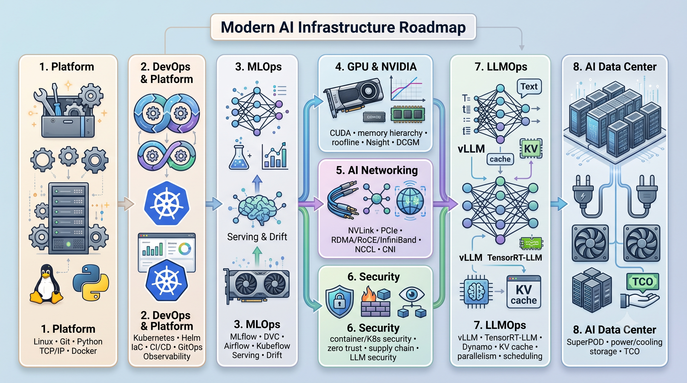

# AI Infrastructure Roadmap 

**English** · [Tiếng Việt](README_vi.md)

> **A note before you start:** I have not finished everything in this roadmap. I am putting it together to set my own goals and learn along the way. If you find mistakes or have better suggestions, please open an issue or a PR — I appreciate any help.

> A learning roadmap for engineers going from DevOps/MLOps into **GPU hardware, AI networking, security, LLMOps and AI Data Centers (AIDC)**.
> Written by a Vietnamese engineer walking this exact path. Resources are grouped by format — **YouTube, Udemy, LinkedIn Learning, NVIDIA DLI, official docs, open-access books** — so you can pick whatever fits how you learn. Every link was checked at the time of writing.

---

## Table of contents

- [AI Infrastructure Roadmap](#ai-infrastructure-roadmap)
  - [Table of contents](#table-of-contents)
  - [📖 How to use this roadmap](#-how-to-use-this-roadmap)
  - [🗺 Roadmap overview](#-roadmap-overview)
  - [1. Foundations: Linux, Git, Python, networking basics, Docker](#1-foundations-linux-git-python-networking-basics-docker)
    - [Linux \& command line](#linux--command-line)
    - [Git](#git)
    - [Python for infrastructure](#python-for-infrastructure)
    - [Networking basics](#networking-basics)
    - [Docker](#docker)
  - [2. DevOps \& Platform Engineering](#2-devops--platform-engineering)
    - [Kubernetes](#kubernetes)
    - [Infrastructure as Code: Terraform, Ansible](#infrastructure-as-code-terraform-ansible)
    - [CI/CD \& GitOps: Jenkins, GitLab CI, ArgoCD](#cicd--gitops-jenkins-gitlab-ci-argocd)
    - [Observability: Prometheus, Grafana, OpenTelemetry](#observability-prometheus-grafana-opentelemetry)
  - [3. MLOps](#3-mlops)
    - [Principles \& system design](#principles--system-design)
    - [Tools (official docs)](#tools-official-docs)
    - [Structured course (Vietnamese)](#structured-course-vietnamese)
  - [4. GPU \& NVIDIA hardware](#4-gpu--nvidia-hardware)
    - [Video](#video)
    - [Books \& docs](#books--docs)
    - [Tools](#tools)
  - [5. AI Networking: interconnect, RDMA, NCCL](#5-ai-networking-interconnect-rdma-nccl)
    - [Video](#video-1)
    - [Books \& docs](#books--docs-1)
  - [6. Security for AI platforms](#6-security-for-ai-platforms)
    - [Video](#video-2)
    - [Books \& docs](#books--docs-2)
  - [7. LLMOps \& large-scale inference](#7-llmops--large-scale-inference)
    - [Video](#video-3)
    - [Books \& docs](#books--docs-3)
  - [8. AI Data Center (AIDC)](#8-ai-data-center-aidc)
    - [Video](#video-4)
    - [Books \& docs](#books--docs-4)
  - [🎓 Certifications](#-certifications)
  - [🧪 Hands-on projects](#-hands-on-projects)
  - [🧭 Other roadmaps \& curated lists](#-other-roadmaps--curated-lists)
  - [🙏 Acknowledgments](#-acknowledgments)
  - [🤝 Contributing](#-contributing)

---

## 📖 How to use this roadmap

1. Sections 1–3 are the base. Sections 4–8 can be studied in parallel depending on what your job needs. If you already know MLOps, jump straight to Section 4.
2. Each section has **Learn** (watch/read) → **Do** (labs) → **Milestone** (something you can show). No milestone, section not done.
3. Legend: 🆓 free · 💰 paid · 🎥 video · 📕 book · 📄 docs/paper · 🧪 lab · ⭐ start here.
4. Keep an English-language engineering journal after each lab. It becomes your portfolio.

---

## 🗺 Roadmap overview

---

## 1. Foundations: Linux, Git, Python, networking basics, Docker

*Everything later runs on Linux, is managed with Git, automated with Python and talks over TCP/IP.*

### Linux & command line
| Resource | Type | Link |
|---|---|---|
| ⭐ The Linux Command Line (William Shotts) | 🆓📕 | https://linuxcommand.org/tlcl.php |
| MIT — The Missing Semester of Your CS Education | 🆓🎥 | https://missing.csail.mit.edu/ |
| Linux Foundation LFS101 — Introduction to Linux | 🆓🎥 | https://training.linuxfoundation.org/training/introduction-to-linux/ |
| Operating Systems: Three Easy Pieces (OSTEP) | 🆓📕 | https://pages.cs.wisc.edu/~remzi/OSTEP/ |
| Dive into Systems | 🆓📕 | https://diveintosystems.org/ |
| LinkedIn Learning — Strategic Linux for Network Professionals: Security, Monitoring, and Automation | 💰🎥 | https://www.linkedin.com/learning/ (search title) |

### Git
| Resource | Type | Link |
|---|---|---|
| ⭐ Pro Git | 🆓📕 | https://git-scm.com/book/en/v2 |
| Learn Git Branching (interactive) | 🆓🧪 | https://learngitbranching.js.org/ |

### Python for infrastructure
| Resource | Type | Link |
|---|---|---|
| Python official tutorial | 🆓📄 | https://docs.python.org/3/tutorial/ |
| Machine Learning Engineering (Andriy Burkov) | 🆓📕 | http://www.mlebook.com/ |
| The Hundred-Page Machine Learning Book | 🆓📕 | https://themlbook.com/ |
| Dive into Deep Learning (D2L) | 🆓📕 | https://d2l.ai/ |

### Networking basics
| Resource | Type | Link |
|---|---|---|
| ⭐ Computer Networks: A Systems Approach (Peterson & Davie) | 🆓📕 | https://book.systemsapproach.org/ |
| Kurose & Ross — free lecture videos for *Computer Networking: A Top-Down Approach* | 🆓🎥 | https://gaia.cs.umass.edu/kurose_ross/index.php |
| Computer Networking: A Top-Down Approach (book) | 💰📕 | https://www.pearson.com/en-us/subject-catalog/p/computer-networking/P200000003334 |
| Practical Networking (YouTube) | 🆓🎥 | https://www.youtube.com/@PracticalNetworking |
| High Performance Browser Networking (Ilya Grigorik) | 🆓📕 | https://hpbn.co/ |
| LinkedIn Learning — Networking Foundations: Networking Basics (Kevin Wallace) | 💰🎥 | https://www.linkedin.com/learning/networking-foundations-networking-basics |

### Docker
| Resource | Type | Link |
|---|---|---|
| ⭐ Docker — Get Started | 🆓📄 | https://docs.docker.com/get-started/ |
| TechWorld with Nana — Docker / Kubernetes / DevOps courses (YouTube) | 🆓🎥 | https://www.youtube.com/@TechWorldwithNana |
| KodeKloud (YouTube) | 🆓🎥 | https://www.youtube.com/@KodeKloud |

🧪 **Do**: build one Ubuntu VM, install Docker, containerize a small Python API behind Nginx, use `tcpdump` and `ss -tulpn` to see where packets go.

---

## 2. DevOps & Platform Engineering

*Kubernetes is the operating system of every AI platform today. This is the toolset you will reuse in every later section.*

### Kubernetes
| Resource | Type | Link |
|---|---|---|
| ⭐ Kubernetes docs & tutorials | 🆓📄 | https://kubernetes.io/docs/tutorials/ |
| Linux Foundation LFS158 — Introduction to Kubernetes | 🆓🎥 | https://training.linuxfoundation.org/training/introduction-to-kubernetes/ |
| Kubernetes The Hard Way (Kelsey Hightower) | 🆓🧪 | https://github.com/kelseyhightower/kubernetes-the-hard-way |
| Killercoda — browser labs | 🆓🧪 | https://killercoda.com/ |
| KodeKloud — courses & labs | 🆓/💰🎥🧪 | https://www.kodekloud.com/ |
| Udemy — Certified Kubernetes Administrator (CKA) with Practice Tests (Mumshad Mannambeth) | 💰🎥 | https://www.udemy.com/course/certified-kubernetes-administrator-with-practice-tests/ |
| LinkedIn Learning — Kubernetes: Provisioning for Infrastructure as Code (Carlos Nunez) | 💰🎥 | https://www.linkedin.com/learning/kubernetes-provisioning-for-infrastructure-as-code |
| LinkedIn Learning — Getting Started with Kubernetes (learning path) | 💰🎥 | https://www.linkedin.com/learning/paths/getting-started-with-kubernetes |
| roadmap.sh — Kubernetes | 🆓📄 | https://roadmap.sh/kubernetes |

### Infrastructure as Code: Terraform, Ansible
| Resource | Type | Link |
|---|---|---|
| Terraform tutorials | 🆓📄🧪 | https://developer.hashicorp.com/terraform/tutorials |
| Ansible docs | 🆓📄 | https://docs.ansible.com/ |

### CI/CD & GitOps: Jenkins, GitLab CI, ArgoCD
| Resource | Type | Link |
|---|---|---|
| Jenkins docs | 🆓📄 | https://www.jenkins.io/doc/ |
| ⭐ ArgoCD docs | 🆓📄 | https://argo-cd.readthedocs.io/ |
| CNCF (YouTube) — KubeCon talks | 🆓🎥 | https://www.youtube.com/@cncf |

### Observability: Prometheus, Grafana, OpenTelemetry
| Resource | Type | Link |
|---|---|---|
| Prometheus docs | 🆓📄 | https://prometheus.io/docs/introduction/overview/ |
| Grafana docs | 🆓📄 | https://grafana.com/docs/ |
| OpenTelemetry docs | 🆓📄 | https://opentelemetry.io/docs/ |
| ⭐ Google SRE books | 🆓📕 | https://sre.google/books/ |

🧪 **Do**: k3s/kubeadm cluster with 2–3 nodes → Helm → ArgoCD syncing from Git → kube-prometheus-stack → dashboards and alerts for one service.
**Milestone**: a Git repository where every `git push` is automatically deployed to your cluster by ArgoCD, and a Grafana dashboard with at least one working alert for a running service.

---

## 3. MLOps

*From notebook to an ML system that runs automatically, with versioning, monitoring and a retrain loop. This is the direct base for LLMOps.*

### Principles & system design
| Resource | Type | Link |
|---|---|---|
| ⭐ Made With ML (Goku Mohandas) | 🆓📕🧪 | https://madewithml.com/ |
| ⭐ Machine Learning Systems (Vijay Janapa Reddi) | 🆓📕 | https://mlsysbook.ai/ |
| ml-ops.org — principles & maturity model | 🆓📄 | https://ml-ops.org/ |
| Google — Practitioners Guide to MLOps | 🆓📄 | https://cloud.google.com/resources/mlops-whitepaper |
| Full Stack Deep Learning | 🆓🎥 | https://fullstackdeeplearning.com/ |
| DataTalks.Club — MLOps Zoomcamp (course + YouTube) | 🆓🎥🧪 | https://github.com/DataTalksClub/mlops-zoomcamp · https://www.youtube.com/@DataTalksClub |
| LinkedIn Learning — MLOps Essentials for Developers and AI Engineers: Tools, Pipelines, Security (learning path) | 💰🎥 | https://www.linkedin.com/learning/paths/mlops-essentials-for-developers-and-ai-engineers-tools-pipelines-security |
| Udemy — The Complete Guide to AI Infrastructure: Zero to Hero | 💰🎥🧪 | https://www.udemy.com/course/complete-guide-ai-infrastructure/ |
| roadmap.sh — MLOps | 🆓📄 | https://roadmap.sh/mlops |

### Tools (official docs)
| Tool | Role | Link |
|---|---|---|
| MLflow | experiment tracking, model registry | https://mlflow.org/docs/latest/index.html |
| DVC | data/model versioning | https://dvc.org/doc |
| Apache Airflow | orchestration | https://airflow.apache.org/docs/ |
| Kubeflow | ML platform on Kubernetes | https://www.kubeflow.org/docs/ |
| Feast | feature store | https://feast.dev/ |
| Ray | distributed training/serving | https://docs.ray.io/ |
| KServe | model serving on Kubernetes | https://kserve.github.io/website/ |
| Triton Inference Server | multi-framework GPU serving | https://github.com/triton-inference-server/server |
| Evidently | drift & data-quality monitoring | https://www.evidentlyai.com/ |

### Structured course (Vietnamese)
| Resource | Type | Link |
|---|---|---|
| ⭐ Full Stack Data Science — cohort-based MLOps/LLMOps course with rubric-graded projects | 💰🎥🧪 | https://fullstackdatascience.com/ |

🧪 **Do**: train → MLflow registry → KServe/Triton → Evidently drift → alert → automatic retrain → canary.
**Milestone**: one repository that trains a model, registers it in MLflow, serves it on Kubernetes, detects data drift with Evidently, and automatically retrains and redeploys (canary) when drift is detected — all triggered without manual steps.

---

## 4. GPU & NVIDIA hardware

*The part most MLOps roadmaps skip. Learn NVIDIA first; other vendors follow the same model (SIMT, memory hierarchy, interconnect).*

**Goal**: for any workload, answer *what moves, how much, how many times, through where, and who waits* — and explain why LLM inference is memory-bound.

### Video
| Resource | Type | Link |
|---|---|---|
| ⭐ PMPP official channel — Izzat El Hajj's GPU Computing lectures | 🆓🎥 | https://www.youtube.com/@pmpp-book |
| ⭐ GPU MODE (YouTube + lecture repo) | 🆓🎥 | https://www.youtube.com/@GPUMODE · https://github.com/gpu-mode/lectures |
| freeCodeCamp — NCA-AIIO prep course (4 h) | 🆓🎥 | https://www.freecodecamp.org/news/pass-the-nvidia-certified-associate-ai-infrastructure-and-operations-certification-exam/ |
| NVIDIA Developer (YouTube) & GTC on-demand | 🆓🎥 | https://www.youtube.com/@NVIDIADeveloper · https://www.nvidia.com/gtc/ |
| OLCF CUDA Training Series (Oak Ridge) | 🆓🎥🧪 | https://www.olcf.ornl.gov/cuda-training-series/ |
| MIT 6.5940 — TinyML & Efficient Deep Learning (Song Han) | 🆓🎥 | https://hanlab.mit.edu/courses/2024-fall-65940 |
| CMU — Deep Learning Systems | 🆓🎥 | https://dlsyscourse.org/ |
| NVIDIA DLI — Fundamentals of Accelerated Computing with CUDA C/C++ | 💰🎥🧪 | https://learn.nvidia.com/ |
| Udemy — CUDA GPU Programming Beginner To Advanced | 💰🎥 | https://www.udemy.com/course/cuda-gpu-programming-beginner-to-advanced/ |
| Udemy — Mastering Parallel programming with CUDA platform | 💰🎥 | https://www.udemy.com/course/mastering-parallel-programming-with-cuda-platform/ |
| Udemy — NVIDIA-Certified Professional: AI Infrastructure (NCP-AII) | 💰🎥 | https://www.udemy.com/course/ncp-aii-nvidia-certified-professional-ai-infrastructure/ |

### Books & docs
| Resource | Type | Link |
|---|---|---|
| ⭐ AI Infrastructure (Bojie Li) — open-source book, ch.4 accelerator architecture, ch.5 memory | 🆓📕 | https://bojieli.github.io/ai-infra-book/ |
| Programming Massively Parallel Processors, 4th ed. (Hwu, Kirk, El Hajj) | 💰📕 | https://shop.elsevier.com/books/programming-massively-parallel-processors/hwu/978-0-323-91231-0 |
| CUDA C++ Programming Guide | 🆓📄 | https://docs.nvidia.com/cuda/cuda-c-programming-guide/index.html |
| An Even Easier Introduction to CUDA (NVIDIA blog) | 🆓📄 | https://developer.nvidia.com/blog/even-easier-introduction-cuda/ |
| GPU Gems 1–3 | 🆓📕 | https://developer.nvidia.com/gpugems/gpugems/contributors |
| NVIDIA Blackwell architecture | 🆓📄 | https://resources.nvidia.com/en-us-blackwell-architecture |

### Tools
| Tool | Link |
|---|---|
| Nsight Systems / Nsight Compute | https://developer.nvidia.com/nsight-systems |
| DCGM + dcgm-exporter | https://docs.nvidia.com/datacenter/dcgm/latest/index.html |
| NVIDIA GPU Operator (driver, device plugin, MIG / time-slicing / MPS) | https://docs.nvidia.com/datacenter/cloud-native/gpu-operator/latest/index.html |
| Kueue (job queueing, GPU quotas) | https://kueue.sigs.k8s.io/ |
| DGX Spark docs & playbooks | https://docs.nvidia.com/dgx/dgx-spark/ · https://build.nvidia.com/spark |

🧪 **Do**
1. `nvidia-smi -q`, `nvidia-smi topo -m`, `lspci -tv` → draw the CPU–GPU–memory–NIC diagram of your machine.
2. DCGM exporter → Grafana: SM active, DRAM active, tensor-core active.
3. Write a matmul kernel, profile with `nsys`/`ncu`, compute arithmetic intensity, draw the roofline.
4. Run vLLM with an 8B model, measure tokens/s at batch 1 → 32, explain it with the roofline.
5. Compute by hand: 70B FP8 weights + KV cache at 32k context — does it fit your GPU?

**Milestone**: a short blog post or repo doc with (1) a diagram of your machine's CPU–GPU–memory–NIC topology, (2) a roofline chart of your GPU built from your own Nsight measurements, and (3) measured vLLM tokens/s at several batch sizes with an explanation of where the bottleneck is. If you want a certificate at this stage, take **NCA-AIIO**.

---

## 5. AI Networking: interconnect, RDMA, NCCL

*Fast GPUs are useless if data does not arrive in time. From inside the box (NVLink/PCIe) to between boxes (RDMA / InfiniBand / RoCE) to Kubernetes.*

### Video
| Resource | Type | Link |
|---|---|---|
| ⭐ NVIDIA Networking Academy — InfiniBand, RoCE, Spectrum-X, Cumulus Linux | 🆓🎥 | https://academy.nvidia.com/ |
| GPU MODE — Lecture 17: GPU Collective Communication (NCCL) | 🆓🎥 | https://github.com/gpu-mode/lectures |
| CNCF (YouTube) — search "Kubernetes networking" KubeCon talks | 🆓🎥 | https://www.youtube.com/@cncf |
| Udemy — InfiniBand Fundamentals for AI & HPC Data Centers | 💰🎥🧪 | https://www.udemy.com/course/infiniband-fundamentals/ |
| Udemy — NCP-AIN practice tests | 💰🎥 | https://www.udemy.com/course/nvidia-ai-networking-ncp-ain/ · https://www.udemy.com/course/ai-networking-certification-prep-questions-ncp-ain/ |
| LinkedIn Learning — Kubernetes: Cloud Native Ecosystem (Karthik Gaekwad) | 💰🎥 | https://www.linkedin.com/learning/ (search title) |

### Books & docs
| Resource | Type | Link |
|---|---|---|
| ⭐ AI Infrastructure (Bojie Li) — ch.6 scale-up / super-node, ch.7 data-center network | 🆓📕 | https://bojieli.github.io/ai-infra-book/ |
| NCCL user guide + nccl-tests | 🆓📄🧪 | https://docs.nvidia.com/deeplearning/nccl/user-guide/docs/index.html · https://github.com/NVIDIA/nccl-tests |
| Learning eBPF (Liz Rice) — free from Isovalent | 🆓📕 | https://isovalent.com/books/learning-ebpf/ |
| ebpf.io | 🆓📄 | https://ebpf.io/ |
| Cilium docs | 🆓📄 | https://docs.cilium.io/ |
| Istio docs | 🆓📄 | https://istio.io/latest/docs/ |

🧪 **Do** (needs two machines with high-speed NICs, e.g. two DGX Spark linked over QSFP)
1. `iperf3` (TCP) vs `ib_write_bw` (RDMA, perftest).
2. Enable RoCE v2 + PFC/ECN; run `all_reduce_perf` with `NCCL_DEBUG=INFO`; read which transport NCCL picked.
3. vLLM tensor-parallel across 2 nodes; compare RDMA vs forced Socket transport.
4. Kubernetes + Cilium; trace one packet ingress → pod with Hubble; write a default-deny NetworkPolicy and open it step by step.

**Milestone**: a document describing your lab network end to end — the physical links, IP/VLAN layout, RDMA configuration, NCCL benchmark results (bandwidth and latency for `all_reduce`), and the Kubernetes CNI/NetworkPolicy setup — with the actual numbers from `iperf3`, `ib_write_bw` and `nccl-tests`. If you want a certificate at this stage, take **NCP-AIN**.

---

## 6. Security for AI platforms

*Threat model → zero trust → supply chain → LLM security.*

### Video
| Resource | Type | Link |
|---|---|---|
| ⭐ Kim Wüstkamp — Kubernetes CKS Full Course (free on YouTube) | 🆓🎥🧪 | https://www.youtube.com/watch?v=d9xfB5qaOfg |
| Udemy — Kubernetes CKS Complete Course (Kim Wüstkamp, includes killer.sh simulator sessions) | 💰🎥🧪 | https://killer.sh/r?d=cks-course |
| LinkedIn Learning — Securing Containers and Kubernetes Ecosystem (Sam Sehgal) | 💰🎥 | https://www.linkedin.com/learning/securing-containers-and-kubernetes-ecosystem |
| LinkedIn Learning — Cert Prep: Kubernetes and Cloud Native Security Associate (KCSA) (Michael Levan) | 💰🎥 | https://www.linkedin.com/learning/cert-prep-kubernetes-and-cloud-native-security-associate-kcsa |
| LinkedIn Learning — Understanding Zero Trust (Malcolm Shore) | 💰🎥 | https://www.linkedin.com/learning/ (search title) |
| KodeKloud — CKS course & challenges | 💰🎥🧪 | https://www.kodekloud.com/ |
| Killercoda — CKS scenarios | 🆓🧪 | https://killercoda.com/ |

### Books & docs
| Resource | Type | Link |
|---|---|---|
| ⭐ Container Security, 2nd ed. (Liz Rice) — free from Isovalent | 🆓📕 | https://isovalent.com/books/container-security/ |
| Kubernetes security concepts | 🆓📄 | https://kubernetes.io/docs/concepts/security/ |
| NSA/CISA Kubernetes Hardening Guide | 🆓📄 | https://www.cisa.gov/news-events/alerts/2022/03/15/updated-kubernetes-hardening-guide |
| NIST SP 800-190 — Application Container Security Guide | 🆓📄 | https://csrc.nist.gov/pubs/sp/800/190/final |
| NIST AI Risk Management Framework | 🆓📄 | https://www.nist.gov/itl/ai-risk-management-framework |
| CKS curated resources (walidshaari) | 🆓📄 | https://github.com/walidshaari/Certified-Kubernetes-Security-Specialist |
| Kyverno docs | 🆓📄 | https://kyverno.io/docs/ |
| HashiCorp Vault tutorials | 🆓📄🧪 | https://developer.hashicorp.com/vault/tutorials |
| Sigstore / cosign docs | 🆓📄 | https://docs.sigstore.dev/ |
| ⭐ OWASP Top 10 for LLM Applications | 🆓📄 | https://genai.owasp.org/ |
| MITRE ATLAS | 🆓📄 | https://atlas.mitre.org/ |
| NVIDIA garak — LLM vulnerability scanner | 🆓🧪 | https://github.com/NVIDIA/garak |
| NVIDIA NeMo Guardrails | 🆓🧪 | https://github.com/NVIDIA/NeMo-Guardrails |
| roadmap.sh — Cyber Security | 🆓📄 | https://roadmap.sh/cyber-security |

🧪 **Do**
1. One-page threat model (STRIDE) for your ML system.
2. Kyverno: enforce `runAsNonRoot`, block `privileged`, require labels; test with a violating pod.
3. Vault + External Secrets Operator; remove every secret from the repo; drop `cluster-admin` from CI.
4. CI: Trivy scan → cosign sign → Kyverno `verifyImages`.
5. mTLS STRICT (Istio or Cilium); verify with tcpdump.
6. Falco runtime alerts; garak scan of an LLM endpoint.

**Milestone**: a pull request merged into your project that adds Kyverno policies, Vault-managed secrets, signed images verified at admission, mTLS between services, and a Falco alert rule — plus a one-page threat-model document explaining what each control protects against. If you want a certificate at this stage, take **KCSA** first, then **CKS**.

---

## 7. LLMOps & large-scale inference

*Operating LLMs = MLOps + GPU memory as the scarcest resource + new evaluation (LLM-as-judge) + cost per token.*

### Video
| Resource | Type | Link |
|---|---|---|
| ⭐ GPU Optimization Workshop (MLOps.community) — talks from TensorRT-LLM (NVIDIA) and Triton (OpenAI) engineers | 🆓🎥 | https://github.com/mlops-discord/gpu-optimization-workshop |
| GPU MODE — Lecture 22 (speculative decoding in vLLM), Lecture 35 (SGLang) | 🆓🎥 | https://github.com/gpu-mode/lectures |
| NVIDIA DLI — Model Parallelism: Building and Deploying Large Neural Networks | 💰🎥🧪 | https://learn.nvidia.com/ |
| NVIDIA Developer (YouTube) — Dynamo, TensorRT-LLM sessions | 🆓🎥 | https://www.youtube.com/@NVIDIADeveloper |

### Books & docs
| Resource | Type | Link |
|---|---|---|
| ⭐ How to Scale Your Model (Google/JAX "Scaling Book") | 🆓📕 | https://jax-ml.github.io/scaling-book/ |
| ⭐ The Ultra-Scale Playbook (Hugging Face) | 🆓📕 | https://huggingface.co/spaces/nanotron/ultrascale-playbook |
| AI Infrastructure (Bojie Li) — ch.8–11 inference, distributed inference, training, scheduling | 🆓📕 | https://bojieli.github.io/ai-infra-book/ |
| AI Performance Engineering (Chris Fregly) — code repo | 🆓🧪 | https://github.com/cfregly/ai-performance-engineering |
| vLLM docs | 🆓📄 | https://docs.vllm.ai/ |
| TensorRT-LLM docs | 🆓📄 | https://nvidia.github.io/TensorRT-LLM/ |
| NVIDIA Dynamo docs | 🆓📄 | https://docs.nvidia.com/dynamo/latest/ |
| gpu-perf-engineering-resources — paper list (FlashAttention-3, PagedAttention, FlashInfer, MLA) | 🆓📄 | https://github.com/JINO-ROHIT/gpu-perf-engineering-resources |

🧪 **Do**
1. vLLM benchmark: prefix caching on/off, `max_num_seqs`, `gpu_memory_utilization` → throughput vs p99 chart.
2. FP8 vs NVFP4 quantization: quality and speed.
3. Kueue + GPU Operator: two teams submit jobs; observe quotas and preemption.
4. LoRA fine-tune across 2 nodes (DDP/FSDP) over RDMA; measure scaling efficiency.
5. Retrain loop: Evidently → Alertmanager → Argo Events → job → MLflow → canary.

**Milestone**: a benchmark report for one LLM on your hardware (throughput vs latency at different batch sizes, FP8 vs NVFP4, single node vs 2-node tensor parallel) and a working automatic retrain loop. If you want a certificate at this stage, take **NCP-AII** (if you build clusters) or **NCP-AIO** (if you operate them).

---

## 8. AI Data Center (AIDC)

*Read a reference architecture; understand how power, cooling, network and storage constrain each other; design a 64–256 GPU cluster on paper.*

### Video
| Resource | Type | Link |
|---|---|---|
| NVIDIA GTC on-demand — search "Spectrum-X", "liquid cooling GB200", "SuperPOD deployment" | 🆓🎥 | https://www.nvidia.com/gtc/ |
| NVIDIA Networking Academy — data-center tracks | 🆓🎥 | https://academy.nvidia.com/ |

### Books & docs
| Resource | Type | Link |
|---|---|---|
| ⭐ The Datacenter as a Computer, 3rd ed. (Barroso, Hölzle, Ranganathan) — open access | 🆓📕 | https://datacenter-book.org/ · https://library.oapen.org/handle/20.500.12657/61844 |
| ⭐ NVIDIA DGX SuperPOD reference architectures | 🆓📄 | https://docs.nvidia.com/dgx-superpod/ |
| Open Compute Project | 🆓📄 | https://www.opencompute.org/ |
| Uptime Institute | 🆓📄 | https://www.uptimeinstitute.com/ |
| AI Infrastructure (Bojie Li) — ch.6, 7, 11, 12 | 🆓📕 | https://bojieli.github.io/ai-infra-book/ |
| ai-infra-curriculum — Architect track | 🆓📄 | https://ai-infra-curriculum.github.io/ |

🧪 **Do (on paper)**: design a 128-GPU training + inference cluster: TFLOPS, HBM, NVLink domains, 400G ports, oversubscription, checkpoint storage GB/s, kW per rack, air vs liquid cooling, on-prem vs cloud TCO.
**Milestone**: a design document for a 128-GPU cluster (compute, network topology, storage, power, cooling, cost) and a 20-minute presentation of it to colleagues or a community group.

---

## 🎓 Certifications

| # | Certification | Link |
|---|---|---|
| 1 | NVIDIA NCA-AIIO — AI Infrastructure & Operations (Associate) | https://www.nvidia.com/en-us/learn/certification/ |
| 2 | KCSA → CKS — Kubernetes security | https://www.cncf.io/certification/cks/ |
| 3 | NVIDIA NCP-AIN — AI Networking | https://www.nvidia.com/en-us/learn/certification/ |
| 4 | NVIDIA NCP-AII / NCP-AIO — AI Infrastructure / AI Operations (Professional) | https://www.nvidia.com/en-us/learn/certification/ |

Exam simulator for CKA/CKAD/CKS: https://killer.sh/

---

## 🧪 Hands-on projects

| Repository | What it is |
|---|---|
| ⭐ https://github.com/DucLong06/face-detection-ml-system | My project: face-detection ML system (Jenkins, GKE, Terraform/Ansible, ELK, Jaeger), being upgraded to on-prem GPU (DGX Spark), GitOps, GPU serving and a security baseline. See the plans branch. |
| https://github.com/ai-infra-curriculum/ai-infra-engineer-learning | 10 modules, 62 labs, 3 projects (model serving → MLOps pipeline → LLM deployment) |
| https://github.com/ai-infra-curriculum/ai-infra-performance-learning | Performance-engineer track: CUDA, Nsight, compression, transformer kernels |
| https://github.com/DataTalksClub/mlops-zoomcamp | Submit a project for free peer review |

---

## 🧭 Other roadmaps & curated lists

| Name | Link |
|---|---|
| ai-infra-curriculum (Engineer / Performance / MLOps / Senior / Architect tracks) | https://github.com/ai-infra-curriculum/ai-infra-engineer-learning · https://ai-infra-curriculum.github.io/ |
| roadmap.sh — MLOps / Kubernetes / Cyber Security / DevOps | https://roadmap.sh/mlops · https://roadmap.sh/kubernetes · https://roadmap.sh/cyber-security |
| AI/ML Platform Engineer — 6-Month Learning Roadmap (gist) | https://gist.github.com/piyushjajoo/51d72850754aabc06ef1f6d994a4d35f |
| awesome-gpu-engineering | https://github.com/goabiaryan/awesome-gpu-engineering |
| gpu-perf-engineering-resources | https://github.com/JINO-ROHIT/gpu-perf-engineering-resources |
| MLOps Engineer Roadmap (100% free video resources) | https://github.com/harish303118/MLOps-Engineering-with-Roadmap-and-Free-Learning-Resources |
| ml-roadmap | https://github.com/loganthorneloe/ml-roadmap |
| Machine Learning Systems (mlsysbook.ai) | https://mlsysbook.ai/ |
| developer-roadmap (roadmap.sh source) | https://github.com/kamranahmedse/developer-roadmap |

> **Looking for AI open-source projects to learn from or contribute to?** I use https://goodailist.com/repos to find currently trending AI repositories.

---

## 🙏 Acknowledgments

This roadmap stands on the work of many people and communities:

- **[Full Stack Data Science](https://fullstackdatascience.com/)** and **[Quan Dang](https://github.com/quan-dang)** — the course that gave me my MLOps foundation (Docker, Kubernetes, Kafka, Spark, Airflow, Kubeflow, Jenkins, GKE, observability) and taught me to build projects against a rubric. Much of Sections 2–3 is what I learned there, rewritten from the perspective of someone now working in the field.
- **[Bojie Li](https://github.com/bojieli/ai-infra-book)** — author of the open-source *AI Infrastructure* book (Apache 2.0), the backbone of Sections 4, 5, 7 and 8.
- **Wen-mei Hwu, David Kirk, Izzat El Hajj** — *Programming Massively Parallel Processors* and the [official lecture channel](https://www.youtube.com/@pmpp-book).
- **[GPU MODE](https://github.com/gpu-mode/lectures)** — the community and free lecture series on GPU performance.
- **Liz Rice / Isovalent** — *Container Security* and *Learning eBPF*, released free.
- **Kim Wüstkamp / Killer Shell** — the CKS course released free on YouTube, killer.sh and Killercoda.
- **Luiz André Barroso, Urs Hölzle, Parthasarathy Ranganathan** — *The Datacenter as a Computer*, open access; **Google SRE** — the SRE books.
- **Larry Peterson & Bruce Davie** — *Computer Networks: A Systems Approach*; **Jim Kurose** — free lecture videos.
- **Vijay Janapa Reddi** — *Machine Learning Systems*; **Goku Mohandas** — Made With ML.
- **ai-infra-curriculum**, **roadmap.sh**, **DataTalks.Club**, **harish303118** (README format), and the maintainers of the curated lists linked above.
- **NVIDIA** — documentation, Networking Academy, DLI and public architecture material.
- **[Claude](https://claude.ai) by Anthropic** — helped me research and verify the links, review my project repository, and draft and structure this README. Every resource was checked and the final selection is mine.

If you are the author of a listed resource and want the description changed or the link removed, please open an issue.

---

## 🤝 Contributing

- Open an **issue** for dead links, outdated material, or a better free source.
- **PRs** adding a resource should state its *type* (🆓/💰, 🎥/📕/📄/🧪), *section*, and one line on *why it belongs*. Official sources (authors, vendors, universities) are preferred over aggregator blogs.
---

*If this helped you, star the repo and share it. If you are on the same path, open an issue — I am still learning too.*
